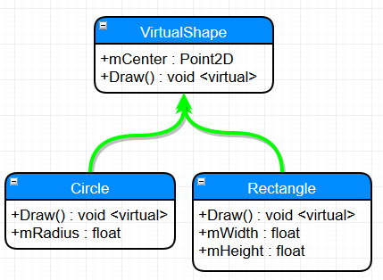
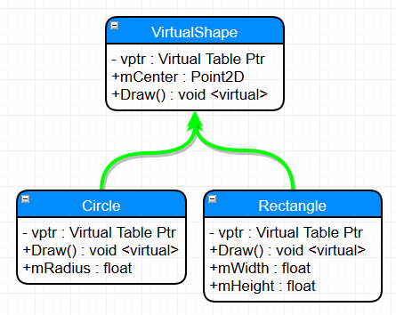
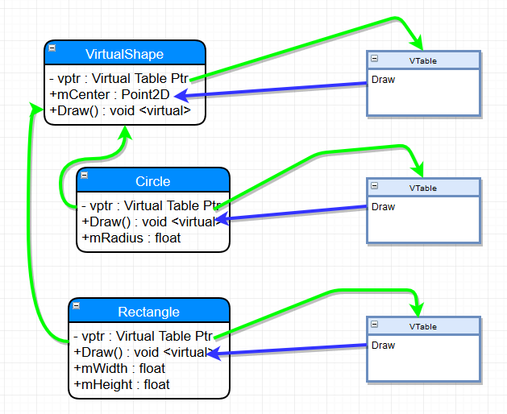
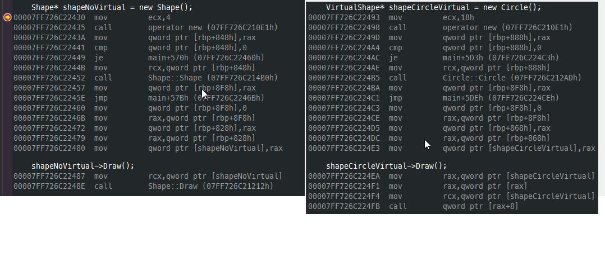

# Pointers in C++

## Summary

This is a review of sorts, but I'm going to dig much deeper into memory specifics of the
C family of languages. Thus I felt it was far more worthwhile to break it into it's own
group of projects.

For the most part, I'll be sticking with Visual Studio, rather than the C++ shell for the
code samples; we want to be looking at memory and Visual Studio has much better tools for
that.

With that said, I forsee the majority of these projects being console applications. I want
these to potentially be portable fairly easily to other compilers/OSes. Making them Windows
applications will hamper that. I also will be avoiding using Allegro this time around as
I want to keep us focused on memory and pointers.

## Why are we looking at pointers?

If you come from other languages like C#, Java, Python, you really haven't had to worry a lot
about memory, from a truly lower level standpoint. However, with C++, you _will_ be very
interested in what's happening with memory.

Why's that? It's pretty simple, actually: 

> C++ is horrifically bad at dealing with memory.

_What??_

If you come from any of those other languages, you will, without a doubt, believe that what
I've just written is the gospel. So why is that?

Let's look at an incredibly simple C# example:

``` C#
using System;

public class Program
{
	public class Shape
	{
		public Shape()
		{
			Console.WriteLine("  -> Shape Constructor");
		}
		
		~Shape()
		{
			Console.WriteLine("  -> Shape Destructor");
		}
		
		public void Draw()
		{
			Console.WriteLine("  -> Shape Draw");
		}
	}
	
	public static void Main()
	{
		Shape A = new Shape();
	}
}
```

[.Net Fiddle version](https://dotnetfiddle.net/knmGE4)

How much are we leaking there? If you said 'none', you're correct. C# will automatically Garbage collect
`A` when it's no longer being used.

The same thing in C++?

``` C++
// Example program
#include <stdio.h>

class Shape
{
public:
    Shape()
    {
        printf("  -> Shape Constructor\n");
    }

    ~Shape()
    {
        printf("  -> Shape Destructort\n");
    }

    void Draw()
    {
        printf("  -> Drawing a shape\n");
    }
};

int main()
{
    Shape* A = new Shape();
}
```

[C++ shell](cpp.sh/7nyr)

How much are we leaking there? I'll give it to you in a percentage: 100% leaky.

Yes, fixing that would be trivial; just add a `delete A`; before main finishes. But that's
no magic bullet. Let me show you something:

``` C++
// Example program
#include <stdio.h>

class Shape
{
public:
    Shape()
    {
        printf("  -> Shape Constructor\n");
    }

    ~Shape()
    {
        printf("  -> Shape Destructort\n");
    }

    void Draw()
    {
        printf("  -> Drawing a shape\n");
    }
};

int main()
{
    Shape* A = new Shape();
    Shape* B = A;
    
    A->Draw();
    B->Draw();
    delete A;
    
    B->Draw();
}
```

What happens there?

[C++ shell](cpp.sh/7womq)

output:

``` prompt
  -> Shape Constructor
  -> Drawing a shape
  -> Drawing a shape
  -> Shape Destructort
  -> Drawing a shape
```

Looks good to me! Next!

Suddenly, a stranger appears next to you, eyeing your computer

"Whoa up there pardner! I think you've got some cattle rustler's in your code there"

Startled, you sit upright in your chair. You could have sworn you locked the front door.
Heart racing, you stammer a shocked response.

"Who the hell are you?"

"Why, I'm the Allocator Kidd. And I think your memory's being rustled up but good! Do y'mind
if'n I take the reigns there?"

He pulls off his leather cowboy gloves, revealing weathered, leathery hands, with millimeter thick
callusses cover the tips of each finger, undoubtably from years of being a keyboard jockey in
the wild west.

You stand up, tenatively offering your chair. With a sly grin he nods, taking a seat, roughly
pulling the keyboard into his lap. With a side glance he looks at your lighted mouse and
mutters to himself

"A mouse. How _quaint_"

He writes two lines of code, smiles and becons you to look at what he's written.

``` C++
int main()
{
    Shape* A = new Shape();
    Shape* B = A;
 
    printf("How big is a Shape? %lu\n", sizeof(A));
    printf("Is that really how big a Shape is? %lu\n", sizeof(*A));
    
    A->Draw();
    B->Draw();
    delete A;
    // ...
```

``` prompt
  -> Shape Constructor
How big is a Shape? 8
Is that really how big a Shape is? 1
  -> Drawing a shape
  -> Drawing a shape
  -> Shape Destructort
  -> Drawing a shape
```

"So, what do you think about them apples, Pardner?"

Looking at the code, you come to realize that asking for the `sizeof(A)` is really only asking
for the size of the pointer for an instance of a `Shape` object. It makes sense for any pointer
on a 64 bit system to be 8 (8*8 = 64 after all).

But why does the `sizeof(*A)` give you a result of 1?

Well, first off, remember that the use of the `*` symbole acts as a 'de-reference' operation.
It essentially takes a pointer and returns the contents at that location, according to the type
of the object it's a pointer of. So it's saying that the Class `Shape` is only ... one byte big?

Is that the case?  You motion to the Data Cowboy to vacate the chair so you can add the following
to the code:

``` C++
    printf("How big is a Shape? %lu\n", sizeof(A));
    printf("Is that really how big a Shape is? %lu\n", sizeof(*A));
    printf("So what is the size of a Shape, really? %lu\n", sizeof(Shape));
```

And the results?

``` prompt
  -> Shape Constructor
How big is a Shape? 8
Is that really how big a Shape is? 1
So what is the size of a Shape, really? 1
  -> Drawing a shape
  -> Drawing a shape
  -> Shape Destructort
  -> Drawing a shape
```

But that can't be right! How can a class only be one byte big.

Our Digital Cowpoke sees the look of consternation on your face, motions to the keyboard and 
begins to type as you move to the side. He adds a bit of code to the bottom of the `Shape` class and
and re-runs the code

``` C++
    void Draw()
    {
        printf("  -> Drawing a shape with text: [%s]\n", value);
    }

    char value[256];
};

int main()
{
    Shape* A = new Shape();
    Shape* B = A;
    strcpy(A->value, "Here is some text");
    printf("How big is a Shape? %lu\n", sizeof(A));
    printf("Is that really how big a Shape is? %lu\n", sizeof(*A));
    printf("So what is the size of a Shape, really? %lu\n", sizeof(Shape));
    
    A->Draw();
    B->Draw();
    
    delete A;
    memset(A, 0, sizeof(Shape));  // Mimicing someone else re-using the memory that was just freed
    
    B->Draw();
}
```

``` prompt
  -> Shape Constructor
How big is a Shape? 8
Is that really how big a Shape is? 256
So what is the size of a Shape, really? 256
  -> Drawing a shape with text: [Here is some text]
  -> Drawing a shape with text: [Here is some text]
  -> Shape Destructort
  -> Drawing a shape with text: []
```

[Source](cpp.sh/6vp72)

The class had no data.

THE CLASS HAD NO DATA.

Now that it has data, we get a size that looks sane. But that doesn't explain why
`sizeof` gave us a value of 1 when there was no data present.

Hopalong Hacker can see where you're going, as he's been there before. He cracks open
your browser and feverently types in a URL he's had memorized long before you could
hold a mouse.

[In Memory of Bjarne](http://www.stroustrup.com/bs_faq2.html#sizeof-empty)

### Why is the size of an empty class not zero?

> To ensure that the addresses of two different objects will be different. For the same reason, "new" always returns pointers to distinct objects.

With that, the Marlborough Man-Of-Code tips his hat to you and disappears in a puff of AND-logic.

But there's still something off with this code.  Look at the results of calling the `Draw` method.

The problem is this: We don't have a complex enough codebase.

Let's talk about the logic of the codebase first:

 - We allocate instances of `Shape` called `A` and assign the pointer `A` to `B`.
   - This just dupicates the pointer; they just point to the same memory block.
 - We delete `A`
 - We then try to access `B` by calling the `Draw` method. And it works

It'll work because we haven't had the chance for another heap allocation to reclaim that block
of memory. But here's the kicker: Because we originally had a class with no data, *IT WOULDN'T MATTER!*

Wait ... why wouldn't it matter? We deleted the instance of the object. If we somehow managed
to reclaim that block of memory for something else ... wouldn't that be an issue?

The answer is, how could it? Remember when we measured the size of the class, it was _effectively_
zero? That's because we only measure fields in a class when allocating memory. The previous
example should have proven that to you, where we allocated a character array 256 bytes long and
we ended up seeing that the size of `Shape` was, in fact, 256 bytes.

But that makes no senes! The code has to live with the object instance, right? We create an
instance of an object and it creates an instance of the code and data. Right?

Let me ask you a question - does the code change between instances of the same class? I mean,
the data does, totally. But _does the code actually change_?

No, it doesn't.

And then, the answer is clear ... Data and Code do *not* live at the same spot in memory.

Here's something to chew on: [Anatomy of a program in memory](http://duartes.org/gustavo/blog/post/anatomy-of-a-program-in-memory/)

I really love that article. It's one of the better written pieces on the layout of a program in memory.
It doesn't answer all the questions, but it's a great start.

All your code lives in what's called the "Text Segment" of your application's process memory.
The data for your class (everything that isn't a function) lives on the Heap. So how does your
class access that data? Well, the compiler understands that there is data associated with each
class and injects into your code a `this` keyword whenever it accesses a class property.

Remember this bit of code?

``` C++
void Draw()
{
    printf("  -> Drawing a shape with text: [%s]\n", value);
}
```

That's in the `Shape` class. Well, the compiler is actually doing (no pun intended) this:

``` C++
void Draw()
{
    printf("  -> Drawing a shape with text: [%s]\n", this->value);
}
```

[Don't believe me? Here you go](cpp.sh/7tzyj)

Are we to the point yet where you think memory handling in C++ is horrific yet?

OK, so it's not actually horrific. You have a tremendous amount of control over memory in C++.
But it's not something trivial you can ignore. Understanding what's going on with memory is
incredibly important to writing good/fast/bugfree code.

## More stuff to watch out for.

Oh, we are not done yet. Not by a long shot.

In the previous example, let me ask you a question:

"Who owns the instance of shape `A`?"

I mean, consider this, from the last example:

``` C++
int main()
{
    Shape* A = new Shape();
    Shape* B = A;
    strcpy(A->value, "Here is some text");
```

What happens when we assign `A` to `B`? In languages like C#, what the 'thing' that `A` points
to has an internal reference count and it increments that when the assignment happens. And
that count gets decremented when `A` or `B` get set to null/set to something else/half a dozen
other reasons.

But what about C++?

By default, C++ has no concept of ownership. Or reference counting. Unless you add it yourself. But I'm getting way, way ahead of myself.
(To be fair, the newest C++ standards adds 'smart pointers' that do this and are considered part of "modern C++". But that's a topic for later.)

At this point, consider that you have to be dilligent of where/how you allocate/assign pointers.

## Class layout in memory

What do we know about classes so far?

 - The logic (methods) for clases live in the 'text' memory block for a program.
 - Data (properties) for classes live either in the Heap or Stack space for a program.
 - Classes without any properties have zero byte sizes, but they actually report back a non-zero size (usually but not guaranteed to be 1) when you query their size.
 - Classes, via 'hidden compiler magic' have an additional `this` keyword, which maps to the address of the classes instance.

Here's a great breakdown of the `this` keyword on [cppreference.com](http://en.cppreference.com/w/cpp/language/this)

So, what happens when we start to consider polymorphism in C++? For example, going back to our `Shape`, `Circle` and `Rectangle`
classes from Review05? Let's bring them on over and try them out!  I'll be removing the Allegro
references so that this is just a console application.

Now let's see what we get when we start mucking around with our `Shape` class again. Currently
our `Shape` class only has an integer in it, but the class is 4 bytes large. Let's put it back
having just a `Point2D` as it's sole property:

``` C++
class ShapeWithPoint
{
public:
    ShapeWithPoint();
    ~ShapeWithPoint();

    void Draw();

    Point2D mCenter;
};
```

I'll add some `printf` code back into main:

`printf("What's the size of a ShapeWithPoint? %lu\n", sizeof(ShapeWithPoint));`

and our result:

``` prompt
What's the size of a ShapeWithPoint? 8
```

That makes sense, `Point2D` has two floats (4 bytes each).

Now, what happens if we make one of the classes virtual?

``` C++
class ShapeWithVirtual
{
public:
    ShapeWithVirtual();
    virtual ~ShapeWithVirtual();

    void Draw();

    int value;
};
```

All we're doing is making the destructor virtual. It allows derived classes
to be delted by deleting a reference to the base class. We'll talk a bit about
that later. However, we're talking about class sizes. So, what do we get now?

``` prompt
What's the size of a ShapeWithVirtual? 16
```

Wait wait wait. We didn't add any new data to the class! why is it bigger? Why is
it 8 bytes bigger? Let's try something - in your code for both `ShapeWithPoint` and 
`ShapeWithVirtual` replace the `Point2D mCenter;` with a `int value;`.

The results are ...

``` prompt
What's the size of a ShapeWithPoint? 4
What's the size of a ShapeWithVirtual? 16
```

What you're seeing is the effect of the V-Table in a class. Going by the 'rule of "the 'largest data type in the class' alignment"
we see that we are on 8 byte alignments. Play around with that a bit, if you
want to be convinced. Or, if you want to be 100% sure, just use `#pragma pack(1)`
like so:

``` C++
#pragma pack(push)
#pragma pack(1)
class ShapeWithPoint
{
public:
    ShapeWithPoint();
    ~ShapeWithPoint();

    void Draw();

    // Point2D mCenter;
    int value;
};

class ShapeWithVirtual
{
public:
    ShapeWithVirtual();
    virtual ~ShapeWithVirtual();

    void Draw();

    // Point2D mCenter;
    int value;
};
#pragma pack(pop)
```

And the output?

``` prompt
What's the size of a ShapeWithPoint? 4
What's the size of a ShapeWithVirtual? 12
```

So how does C++ implement polymorphism? Knowing what it is and knowing how it's implemented
are two very, very different things.

With our `Shape`, `Circle` and 'Rectangle` classes, we've seen that we can keep track of a
`Shape` pointer, but put a pointer to an instance of a `Circle` in there and we call the `Draw`
method, it will resolve it to the correct object instance's `Draw` call. You know, like we did
in `Review05`:

``` C++
VirtualShape** shapes = new VirtualShape*[10];

shapes[0] = new Circle(20.0f, 30.0f, 5.0f);
shapes[1] = new Circle(40.0f, 60.0f, 10.0f);
shapes[2] = new Circle(60.0f, 90.0f, 15.0f);
shapes[3] = new Circle(80.0f, 120.0f, 20.0f);
shapes[4] = new Circle(100.0f, 150.0f, 30.0f);
shapes[5] = new Rectangle(200.0f, 300.0f, 5.0f, 5.0f);
shapes[6] = new Rectangle(220.0f, 330.0f, 10.0f, 10.0f);
shapes[7] = new Rectangle(240.0f, 360.0f, 15.0f, 15.0f);
shapes[8] = new Rectangle(260.0f, 390.0f, 20.0f, 20.0f);
shapes[9] = new Rectangle(280.0f, 420.0f, 25.0f, 25.0f);

for (int index = 0; index < 10; index++)
{
    shapes[index]->Draw();
}
```

That's polymorphism.  But how does it work, under the hood? Each compiler can do it a little
differently, but it really comes down to a Virtual Table and a Virtual Table Pointer.

In each instance of a class, a `Virtual Table Pointer` (commonly refered to as a `vptr`) is created - it is a pointer to a table
of virtual functions (again, commonly referred to as a `vtable`).  `vtable`s usually contain the
following:

 - Virtual function dispatch information.
 - Offsets to virtual base class subobjects
 - RTTI for the object (depending on compiler options).

 What we end up getting, when you take a look at something like this:

 `shapes[index]->Draw();`

 Really ends up being more like this:

 `(*shapes[index]->vptr[n])(shapes[index])`

 which is a pointer to a function. Not that `vptr[n]` is a slot in the `vtable` at the `n`th element.

 Kind of like this:

 

 So, what's really going on with the compiler is that there is an added virtual function table pointer
 adding into the defintion of the class:

 

 Which then links to the Virtual Function Table for each class, referring to the appropriate
 virtual function:

 

 Hopefully the diagram helps - each class ends up with a virtual function table that then links to the appropriate
 virtual method.

 Let's do something a little different - let's add a virtual function into the base and only override it in
 one of the classes:

 

 Yes, it can get pretty complex, with vtables pointing across class methods, but that's what
 inheretence means. And, following the object model, that can be pretty damn groovy.

 But it comes with a cost. Let's look at the disassembly difference between Shape (not Virtual) and Circle (virtual)

 

 Creation of each object is the same, assembly wise. However invoking the `Draw` function on a
 virtual function incurs a different execution path. Specifically we get a `call` to 
 the `Shape::Draw` method in the non virtualized `Shape` versus the call to an address in the
 virtualized version.

 The cost here is two additional `mov`s to call the virtual `Draw` method. Yeah, I know, that
 doesn't sound like much - two additional assembly instructions. Big whoop.

 Yet that can add up, being invoked several hundred or several thousand times per frame. Remember,
 a frame is 1/30th (or 1/60th, or 1/120th) of a second.

 But that's not *really* where our code can become slow. One thing C++ compilers do all the time
 is _inline_ code.  You may have seen in some C++ code the use of the keyword `inline` - it's kind
 of the same thing. The goal of the `inline` keyword was to flag the optimizer of the compiler
 to _inline substitution of a function_ rather than invoking a function call. Function calls are
 slower as they mean creating a new stack, pushing data onto that stack, invoking a jump to that
 function, returning from that function and peeling results from that function off the stack.

 With virtual functions, you can't inline that code base because you can't infer what the code actually
 is, in the general case. That's it. That's why it can be slow.

 For stuff you call a few hundred times a frame, that might not be too bad a trade-off for a
 simple architecture. But for complex hierarchies, or deep object trees, you might not want to
 rely on virtual methods.

 As a great read on the tradeoffs between polymorphic code and other options, I offer up this
 fantastic section on Stack Exchange [here](https://softwareengineering.stackexchange.com/questions/301510/in-general-is-it-worth-using-virtual-functions-to-avoid-branching).


 ## Summary
 
 Well, again that was a longish bit of writing. It's not trivial, but it's good stuff to have
 under your belt. And it's important to understand this stuff, even if you're not digging into
 the guts of low level optimization every day (I know I don't).

 Hope that helps out!

 ## Some references:

 [C++ Virtual functions](http://anderberg.me/2016/06/26/c-virtual-functions/)


