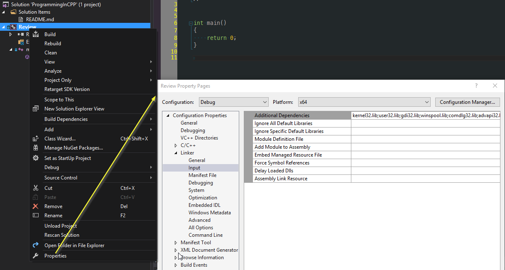

# Where we talk about the Generating code

For a lot of folks coming in from other, more modern languages, the process of creating an executable, library or DLL
in the C++ ecosystem is a little foreign in the days of JIT compilers and scripting languages. It does have it's perils
as it can be a slow build process on larger codebases (compared to C#) but there is an elegance about it.

Take, for instance, the following C++ code:

``` C++
#include <stdio.h>

int main()
{
    printf("Hello World\n");
}

```

You can take that code, verbatim, and fire it into the C++ shell here [C++ Shell](http://cpp.sh/7jiaj) and you see the output
in the execution window.

But that is obfuscating a lot of what's happening under the hood.

1. First off, the compiler takes a look at the source code. It generates an `.obj` file which is an 'intermeditate' file. You can think of it as 'mostly' machine code, but it has additional information associated with it that is used by the next step, the Linker.
1. The linker takes a set of `.obj` files, as well as any library files, and combines them into a final, resultant file. This final file can be an executable, another library, or a DLL.

Now, that is an incredibly simple overview of what's going on. Let's actually talk about what's really happening there. Let's assume a more complex project, that contains a set of source files (a large set of `.cpp` files)

## The C++ Preprocessor

The C++ preprocessor takes the source file and expands all the `preprocessor` directives in your code. The simplest definition of a preprocessor directive is - take a look at any line that starts with a `#` - the operation that follows that is expanded inline in the code base. So, for the `#include <stdio.h>` line, the contents of the file `stdio.h` are essentially copied and pasted into the source file.

Now, the C++ preprocessor can do a *lot* of things. We'll talk about that later, because it's incredibly important. Just be aware that it's one of the foundational pieces of the C++ language.

## Compiler

Each expanded source file is then compiled into the assembly language/machine code for the desired platform as an '.obj' file. A compiler can generate assembly language for multiple architectures, if it's capable of doing so. The compiler will also inject additional information about functions, classes and a few other bits, for the next stage

## Linker

Now that we have individual `.obj` files for each source file, the linker now takes all the individual pieces and Links them together into one piece. This can be an executable, a library, or a DLL.

The other thing to note is that the Linker will also link in other 'things' from external libraries. Remember in the example 'hello world' source, we call the function `printf("Hello World\n");`? Well, `printf` isn't a function that's native to the C++ language. It's defined in an external Library and it's function signature is defined through `stdio.h`.

Visually, it kind of looks like this process:


The next question is, how does the compiler know how to find the actual source code for the function `printf`? Trust me (or go look yourself), it's not declared in `stdio.h`. We know that the linker will eventually resolve it into a library, but how do we tell the compiler what library to use? We're lucky in Visual Studio, there's a nice dialog for that:

