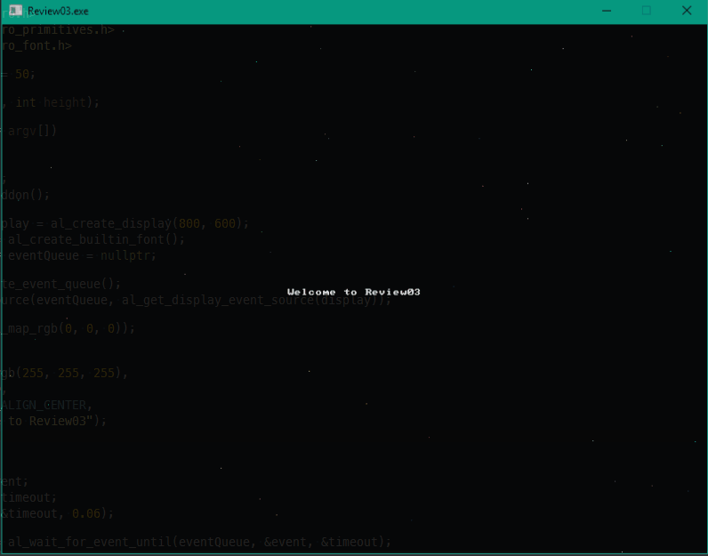

# Review 3 - Where we start coding

## Summary

Up to this point, we've been working through some fundamental of setting up 
and building code. We haven't actually made a program that *does* anything.
I've spent a bit of time trying to figure out what our actual review project
would be that is _something_ other than a trivial `Hello World` example. I wanted
it to be something that is both simple, but has some relevance.

Since we all have some interest in graphics, I took around to see what's out there
for simple graphics abstractions. I don't want to go over OpenGL or DirectX just yet;
I've covered both of those, in C# in other tutorials. This set of reviews is about
C++.

There are a *lot* of options out there: [SDL](https://www.libsdl.org/download-2.0.php),
[GLFW](http://www.glfw.org),
[SFML](https://www.sfml-dev.org),
[Cinder](https://libcinder.org),
[Ogre3D](http://www.ogre3d.org),
[BGFX](https://github.com/bkaradzic/bgfx),
[Magnum](https://github.com/mosra/magnum)
... the list is quite large. Don't believe me? Go to [Github](https://github.com/search?l=C%2B%2B&q=graphics&type=Repositories&utf8=✓)
and see the results for yourself. Now, that list includes engines as well as Graphics libraries
but I think it illustrates the point; picking a library isn't a trivial task.

I finally chose Allegro. I'll try out other libraries as well, but I went with Allegro because:

 - It's got a good NUGet integration with Visual C++:  >>[look here](https://wiki.allegro.cc/index.php?title=Windows,_Visual_Studio_2015_and_Nuget_Allegro_5)<<
 - I'm not looking for 3D or complex drawing facilities.
 - I've used it way, way, way back, so there's a bit of familiarity with it.

I don't have stong opinions on Allegro just yet. I've used other wrappers in the past and
they all have their strengths and weaknesses. So be adventurous and try a few other libraries
on your own!

_NB_: I may give [tinyrender](https://github.com/ssloy/tinyrenderer) a try, as it 
illustrates mixing in source files from an external project later.

## Allegro setup

I've already added to this project the Allegro NUGet package. I had to modify the `vcproj`
by hand, but that was a trivial thing to do (mostly to get the NUGet package folder correct).

I'm not going to go into detail as to how I set it up - that's covered in the earlier link
to Allegro. That and depending on your OS, you'll have different requirements. But feel free
to use this project as a point of reference if you're going the Visual C++ route.

One thing I do want to point out is that I am linking the libraries against a single, monolithic
`static library`. So what are the options here, and what do they mean.

Simply put, our options are:

 - static library
 - DLL
 - Multithreaded DLL

What are these? What do they mean. I don't want to assume you all know the difference, so I'll
take a minute to explain (and for more information, you can research further on your own).

### Static Library

In our previous examples, specifically in Review 2, we were linking against a static library. What
this means is that the functions/classes that live in a library are copied from the library and
embedded directly into the final executable. That `printf` function that we used? Remember, that's
not part of the C++ language, it's a library function that lives in the "C Run-Time" (CRT) library. 
Different compilers. For the Microsft compiler, that's the "libcmt*.lib" and "msvcrt*.lib".

From the Microsoft reference site [here](https://msdn.microsoft.com/en-us/library/abx4dbyh.aspx)
we have the following:

| Library      | Characteristics | Option | Preprocessor directives |
| ------------ | --------------- | ------ | ----------------------- |
| libcmt.lib   | Statically links the native CRT startup into your code. | 	/MT | _MT |
| libcmtd.lib  | Statically links the Debug version of the native CRT startup. Not redistributable. | 	/MTd | _DEBUG, _MT |
| msvcrt.lib   | Static library for the native CRT startup for use with DLL UCRT and vcruntime. | /MD | _MT, _DLL |
| msvcrtd.lib  | Static library for the Debug version of the native CRT startup for use with DLL UCRT and vcruntime. Not redistributable. | /MDd | _DEBUG, _MT, _DLL |

I've thinned out this table as we don't want to talk about managed languages yet.

`libcmt.lib` and `libcmtd.lib` take the machine code, stored in the respective `.lib` file and embeds
that into your executable. It's that simple.

`msvcrt.lib` and `msvcrtd.lib` inject a ... reference, for want of a better term, into your
executable that looks into a DLL (`MSVCP*.dll`) for the function to call.

So, why DLLs? Simply put, it allows the author of the library to change the function (to fix issues) or
to share the function across multiple applications. Think about it this way - every application
that uses `printf` as a static library has to embed that function into their executable, bloating
the size of the executable. You have hundreds (if not thousands) of executables on your machine,
each embedding the same functions into the execuatble and you've got and incredible amount of duplication
of a single function across executables. Putting common functions into a DLL avoids that. It also means that if your function has issues, all you
have to do is replace the DLL to get a new version of that function.

But that also runs us into other problems. You've no doubt heard the term on windows for 'DLL Hell'.
You might not have a great definition for this - so let me lay out an example for you.

Say you have a vendor that provides application A that installs a set of DLLs. Later, the same vendor
might distribute another application, B, that also installs a new set of DLLs, but they haven't
updated application A to use the new DLLs. And a shared function in those DLLs has been updated. It
is now completely possible that change has broken application A. So you uninstall application A, which 
removed the DLL shared with application B and now application B fails to work. And the cycle continues
if you reinstall application A ...

It's not as bad as that, because you can resolve a number of those issues by versioning your DLL, but that
comes with its own set of problems.  Anyway, the long and the short of it is, for these Reviews, where possible
I will be statically linking the executables.

## The C/C++ Language - Essentials

In the first few reviews, I glossed over a lot of the C++ syntax to focus more on the structure of the 
build process. I'll fall back here a bit now and do a very high-level review of the more C like aspects of C++;
looking at core language syntax, data types, functions, conditionals and loops.

But first, the code!

``` C++
// Review03.cpp : Defines the entry point for the application.
//

#include <stdio.h>
#include <allegro5\allegro.h>
#include <allegro5\allegro_image.h>
#include <allegro5\allegro_primitives.h>
#include <allegro5\allegro_font.h>

const int maxiterations = 50;

void DrawFrame(int width, int height);

int main(int argc, char* argv[])
{
    al_init();
    al_init_font_addon();
    al_init_image_addon();
    al_init_primitives_addon();

    ALLEGRO_DISPLAY* display = al_create_display(800, 600);
    ALLEGRO_FONT* font = al_create_builtin_font();
    ALLEGRO_EVENT_QUEUE* eventQueue = nullptr;

    eventQueue = al_create_event_queue();
    al_register_event_source(eventQueue, al_get_display_event_source(display));

    al_clear_to_color(al_map_rgb(0, 0, 0));

    al_draw_text(font,
                al_map_rgb(255, 255, 255),
                400, 300,
                ALLEGRO_ALIGN_CENTER,
                "Welcome to Review03");

    while (true)
    {
        ALLEGRO_EVENT event;
        ALLEGRO_TIMEOUT timeout;
        al_init_timeout(&timeout, 0.06);

        bool get_event = al_wait_for_event_until(eventQueue, &event, &timeout);

        if (get_event && event.type == ALLEGRO_EVENT_DISPLAY_CLOSE)
        {
            break;
        }

        DrawFrame(800, 600);

        al_flip_display();
    }

    al_destroy_font(font);
    al_destroy_display(display);

    return 0;
}

void DrawFrame(int width, int height)
{
    // Drawing individual pixels in this manner is incredibly slow. This is only for illustration
    // on the C syntax.
    for (int index = 0; index < maxiterations; index++)
    {
        al_put_pixel(rand() % width, rand() % height, al_map_rgb(rand()%255, rand()%255, rand()%255));
    }
}
```

And, as an output, we get the following:



### C++ Comments

Not going to say a lot about comments. There are two types:

 - `//`: Begins a comment which continues until the end of the line. Can be put anywhere in the line.
 - `/* */`: Begins a comment block that starts with the `/*` and ends with the `*/`. Can start or end anywhere.

### Preprocessor Macros

When you start with the `#` symbol, you are beginning a 'Preprocessor Directive'. Each directive
occupies one line (and can be extended across multiple lines using the `\` continuation character)
and has the following format:
 - after the `#` symbol, you can invoke one of the following commands:
   - define
   - undef
   - include
   - if
   - ifdef
   - ifndef
   - else
   - elif
   - endif
   - line
   - error
   - pragma
 - you can then add any arguments, based on the aforementioned instruction.

What we are currently doing with the preprocessor is including a header file in lines 4-8 of
the example program. These bring in the function signatures as well as other elements defined
in the header files. Feel free to peruse the files to see what jumps out at you.

Later, we'll discuss more about preprocessor macros. But for now, it's enough to understand that
there is more to the preprocessor than just includes.

### Constants

The next line:

`const int maxiterations = 50;`

defines a variable of type `int` (integer value) that is constant - it can be set once and
cannot be changed after the fact.

We'll also dig into the `const` keyword later as it has multiple uses.

### Forward Declarations

Next, we see this:

`void DrawFrame(int width, int height);`

This tells the compiler that we have a function called `DrawFrame` the has no return (thus the `void`
in front of the function) and takes two arguments (an integer `width` and `height`). Note that this is
exactly what you would put into a header file.

### The Entry Point Into Our Application

In C/C++ we define the entry point to our application as:

`int main(int argc, char* argv[])`

Actually, that's a bit of a lie. For a 'console' application, we define the entry point as above.
You can also define the entry point into your application like so:

`int main()`

or

`void main()`


`int main()` requires you to return an 'error code' back to the Operating System. A return
value of `0` indicates no error in program execution. Anything else is an error. These 'error results'
can be processed by batch files (or shell scripts) to control batch processing flow. But that
discussion is outside of the scope of this article.

`void main()` requires no return value. The OS assumes that the program has other means of
determining or logging error conditions.

However, back to the original definition: 

`int main(int argc, char* argv[])`

The two parameters passed into the `main` function, `argc` and `argv`:
 
`argc` 
 - represents the number of 'arguments' passed in on the command line.
 - we always include the application name in that count
   - eg: 
     - `app.exe` has an `argc` value of 1
     - `app.exe /F /S /N` has an `argc` value of 4

`argv`
 - This is an array (that's what `[]` represents in C/C++) of `char` pointers.
 - `char *` is a 'null terminated string' - it's the C/C++ way of defining strings.
 - All native strings in C/C++ have a `null` that defines the end of the string.
 - ** this does not include other string types, like STL's `string`.

What does this mean?  In the example of the command line looking like this:

`app.exe /F /S /N`

You can access each element in the command line like so:

| array element | value |
| - | - |
| `argv[0]` | `"app.exe"` |
| `argv[1]` | `"/F"` |
| `argv[2]` | `"/S"`|
| `argv[3]` | `"/N"`|
| `argv[4]` | *an error* |

We'll go into character strings later. For now, understand that the `char` C/C++ data type
maps to a single byte.

### Calling Functions

Like `printf`, calling a function is pretty straightforward:

``` C++
    al_init();
    al_init_font_addon();
    al_init_image_addon();
    al_init_primitives_addon();
```

Each of those lines represents a call to an Allegro function. Each of those functions are defined
in a header file. They should map to:

| Function Name            | Header File          |
| ------------------------ | -------------------- |
| al_init                  | allegro.h            |
| al_init_font_addon       | allegro_font.h       |
| al_init_primitives_addon | allegro_primitives.h |

### Declaring Variables

Nothing fancy about the following - we're just declaring variables:

``` C++
    ALLEGRO_DISPLAY* display = al_create_display(800, 600);
    ALLEGRO_FONT* font = al_create_builtin_font();
    ALLEGRO_EVENT_QUEUE* eventQueue = nullptr;
```

OK, one thing that may be a bit odd, if you're coming from an older version of C++, we
have a `nullptr` keyword. This was added into the language spec back in C++ 11. This is
a 'pointer literal'. When we dig into pointers later, we'll go over it more, but understand
that `nullptr` is much more useful to us that `null` was. So if your compiler supports it,
use it.

What kinds of variables do we have availble to us in C/C++? There actually aren't that many:

| Type Name | Description |
| --------- | ----------- |
| char      | A single byte worth of information. This usually maps to the ASCII code table. But not necessarily. |
| int       | An integer. This can have modifers added to it like `unsigned`, `short` and `long`. |
| float     | An IEEE floating point number. A great breakdown of it is [here](http://steve.hollasch.net/cgindex/coding/ieeefloat.html). |
| double    | See the above for a breakdown of a double. |
| bool      | True or False, 1 or 0, on or off - it's a boolean! |
| void      | Represents nothing. Used to define no return value in a function, but also has other (pointer) meanings. |

We can enhance the base types even further using additional keywords:

| Classification   | Type names                 | Width (bits) | Notes                                                                                                    |
| ---------------- | -------------------------- | :----------: | -------------------------------------------------------------------------------------------------------- |
| Character types  | `char`                     | 8            |                                                                                                          |
|                  | `char16_t`                 | 16           | At least as big as a `char`.                                                                             |
|                  | `char32_t`                 | 32           | At least as big as a `char16_t`                                                                          |
|                  | `wchar_t`                  | 8/16/32      | Wide character - supports the largest character set based on compiler.                                   |
| Signed Integer   | `short int`                | 16           | Optimized for space to have at *least* 16 bits.                                                          |
|                  | `int`                      | 16/32        | First number is the C++ standard definition. Additional number is the max based on specialized compiler. |
|                  | `long int`                 | 32/64        | First number is the C++ standard definition. Additional number is the max based on specialized compiler. |
|                  | `long long int`            | 64           |                                                                                                          |
| Unsigned Integer | `unsigned` `short int`     | 16           | Optimized for space to have at *least* 16 bits.                                                          |
|                  | `unsigned` `int`           | 16/32        | First number is the C++ standard definition. Additional number is the max based on specialized compiler. |
|                  | `unsigned` `long int`      | 32/64        | First number is the C++ standard definition. Additional number is the max based on specialized compiler. |
|                  | `unsigned` `long long int` | 64           |                                                                                                          |
| Floating point   | `float`                    | 32           | [reference](http://en.cppreference.com/w/cpp/language/types)                                             |
|                  | `double`                   | 64           | [reference](http://en.cppreference.com/w/cpp/language/types)                                             |
|                  | `long double`              | 80           | [reference](http://en.cppreference.com/w/cpp/language/types)                                             |
| Boolean          | `bool`                     | 8            | No, it is not 1 bit. Each bool takes up 8 bits. This is why bitmasks/bitflags are useful.                |
| Miscelleaneous   | `void`                     | 0            | No data storage for a `void`.
|                  | `nullptr`                  | *            | nullptr is the same size as a pointer. This can vary. |

We are not limited to just these data types. We can create our own 'types' via structures and classes. However, they must be composed, at a bare minimum, of these types.
I'll leave it to the reader to understand the min/max values that can be stored in each numerical data type.

### Loops and Conditionals

Just like every language out there, C/C++ has loops and conditionals.

Loops look like this:

``` C++
// while loop
// while (<iteration condition>)
// {
//     // do stuff
// }

int index = 0;
while (index < 10)
{
    index = index + 1; // can also be written 'index++;` or '++index;'
}

// for loop
// for ( <init>; <iteration condition>; <expression>)
// {
//     // do stuff
// }

for (int counter = 0; counter < 10; counter++)
{
    printf("counter: %d\n", counter);
}

// do while loop
// do
// {
//     // do stuff
// } while (<iteration condition>)

index = 0; // index was already declared above
do
{
    index++;
} while (index < 10)

// More advanced looping structures that we'll cover later
// but show here for a level of completeness, as this was 
// introduced in C++ 11 and has a series of additional features.
// This, however, is the simplest case.
int localVector[] = {5, 10, 20, 100, 1024, 5150};
for (int value : localVector)
{
    printf("%d ", value);
}
```

C++ also has conditional statements:

``` C++
// If condition
// if (<expression evaluates to true>)
// {
//      // do stuff 
// }

int value = 0;
if (value == 1)
{
    // Do stuff
}

// If-Else condition
// if (<expression evaluates to true>)
// {
//      // do stuff 
// }
// else
// {
//      // do something else
// }
if (value == 1)
{
    printf("We don't see this\n");
}
else
{
    printf("We see this\n");
}

// If-ElseIf condition
// if (<expression evaluates to true>)
// {
//      // do stuff 
// }
// else if (<expression evaluates to true>)
// {
//      // do something else
// }
// else // optional
// {
//      // otherwise we do this
// }

value = 3;
if (value == 0)
{
    printf("We don't see this\n");
}
else if (value == 1)
{
    printf("We don't see this either\n");
}
else
{
    printf("We see this\n");
}

// Switch statement
// switch (<expression>)
// {
//      case <constant1>:
//      { // Brace is optional, but recommended for scoping
//          // Do stuff
//      }
//      break;
//
//      case <constant2>:
//      { // Brace is optional, but recommended for scoping
//          // Do stuff
//      }
//      break;
//
//      case <constantN>:
//      { // Brace is optional, but recommended for scoping
//          // Do stuff
//      }
//      break;
//
//      default:
//      { // Brace is optional, but recommended for scoping
//          // Do stuff
//      }
//      break;
// }

switch (value)
{
    case 0:
    {
        printf("Value is a zero\n");
    }
    break;

    case 1:
    {
        printf("Value is a one\n");
    }
    break;

    default:
    {
        printf("I don't know!\n");
    }
    break;
}
```

I expect there's nothing new there for everyone, but I wanted to add it just for completeness sake.

In the code, the only thing I'll point out is:

``` C++
    while (true)
    {
        ALLEGRO_EVENT event;
        ALLEGRO_TIMEOUT timeout;
        al_init_timeout(&timeout, 0.06);

        bool get_event = al_wait_for_event_until(eventQueue, &event, &timeout);

        if (get_event && (event.type == ALLEGRO_EVENT_DISPLAY_CLOSE))
        {
            break;
        }
```

In the above, the conditional `if (get_event && (event.type == ALLEGRO_EVENT_DISPLAY_CLOSE))` has a `&&` in it.
that is the boolean `AND` operator. The Boolean `OR` operator is defined as `||`.

Please note that there is a difference between `&&` and `&` as well as `||` and `|`. The first,
as pointed out earlier defines a boolean `AND`/`OR` operation. The latter defines a _bitwise_ 
`AND`/`OR` operation. If you don't know what a bitwise operation is, we need to talk.

## To Summarize

That's one fully functional C/C++ bit of code. We've looked at the language from a fairly simple
starting point with this bit of code. In the next Review, we'll look at classes to round out the
simple language review. We'll also talk about different build types and what they're used for.

With that, I'm out.