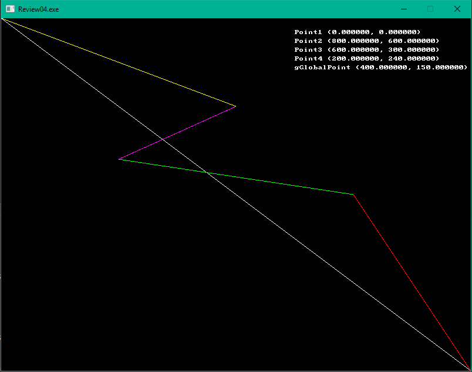
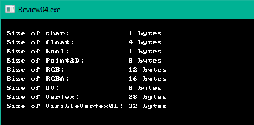
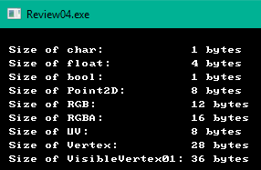
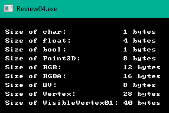
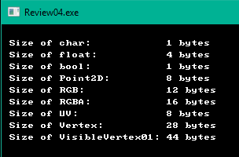
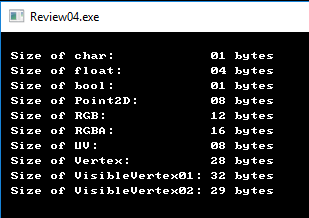

# Review 04 - Where we discuss structs, classes and other stuff

## Overview

The source code this time around is going to be a little different. We're going to have multiple
examples to go over. So this time, the `main.cpp` will work as a driver, executing optional `examples`.

The code structure will look like this:

``` prompt
main.cpp
  - example01.cpp
  - example02.cpp
  - and so on.
```

The `main` function itself will look like this:

``` C++
enum Executables
{
    ex01 = 0,
    ex02,
    endoflist
};

void main()
{
    Executables toRun = ex01;

    switch (toRun)
    {
        case ex01:
        {
            example01();
        }
        break;

        case ex02:
        {
            example02()
        }
        break;

        default:
            break;
            
    };
}
```

Change the value of `toRun` to try a different example.  Yes, I could drive this via the keyboard
and a prompt, but you'll want to evaluate (and change) each of the examples. Changing a single int
value will, in my option, be the faster way to iterate.

## Our first example (example01.h/cpp)

Here's a look at the code behind our first example:

``` C++
/// =====================================================================================
/// In this example, we look at defining new data types using the `struct` keyword
/// =====================================================================================

#include <allegro5/allegro.h>
#include <allegro5/allegro_font.h>
#include <allegro5/allegro_primitives.h>

extern ALLEGRO_FONT* gFont;

/// standard C++ definition of a struct
struct Vertex
{
    float x;
    float y;
};

/// definition of a struct with an instance of the struct (a variable,
/// in this case, called `gGlobalPoint`)
struct Point3D
{
    float x;
    float y;
    float z;
} gGlobalPoint;

/// The more C friendly version
extern "C"
{
    typedef struct Point2D
    {
        float x;
        float y;
    } Point2D;
}

const float width = 800.0f;
const float height = 600.0f;

void Example01()
{
    struct Vertex point1; // This is valid (and very c like)
    Vertex point2;  // This is valid, and C++

    gGlobalPoint.x = 0.5f * width;
    gGlobalPoint.y = 0.25f * height;

    point1.x = 0.0f;
    point1.y = 0.0f;

    point2.x = 1.0f * width;
    point2.y = 1.0f * height;

    /// An anonymous struct
    struct 
    {
        float x;
        float y;
    } point3;
    point3.x = .75f * width;
    point3.y = .5f * height;

    Point2D point4; // This is C like
    point4.x = .25f * width;
    point4.y = .4f * height;

    // Initialization of the new variable `textPos`
    Vertex textPos =
    {
        500.0f,  // x field of Vertex
        20.0f    // y field of Vertex
    };

    // And draw some text to show what points we're looking at
    al_draw_textf(gFont, 
        al_map_rgb(255, 255, 255), 
        textPos.x, textPos.y, 
        ALLEGRO_ALIGN_LEFT, 
        "Point1 (%f, %f)", point1.x, point1.y);
    textPos.y += 15;

    al_draw_textf(gFont, 
        al_map_rgb(255, 255, 255), 
        textPos.x, textPos.y, 
        ALLEGRO_ALIGN_LEFT, 
        "Point2 (%f, %f)", point2.x, point2.y);
    textPos.y += 15;

    al_draw_textf(gFont, 
        al_map_rgb(255, 255, 255), 
        textPos.x, textPos.y, 
        ALLEGRO_ALIGN_LEFT, 
        "Point3 (%f, %f)", point3.x, point3.y);
    textPos.y += 15;

    al_draw_textf(gFont, 
        al_map_rgb(255, 255, 255), 
        textPos.x, textPos.y, 
        ALLEGRO_ALIGN_LEFT, 
        "Point4 (%f, %f)", point4.x, point4.y);
    textPos.y += 15;

    al_draw_textf(gFont, 
        al_map_rgb(255, 255, 255), 
        textPos.x, textPos.y, 
        ALLEGRO_ALIGN_LEFT, 
        "gGlobalPoint (%f, %f)", gGlobalPoint.x, gGlobalPoint.y);
    textPos.y += 15;

    // Finally, draw some lines.
    al_draw_line(point1.x, point1.y, point2.x, point2.y, al_map_rgb(255, 255, 255), 1);
    al_draw_line(point2.x, point2.y, point3.x, point3.y, al_map_rgb(255, 0, 0), 1);
    al_draw_line(point3.x, point3.y, point4.x, point4.y, al_map_rgb(0, 255, 0), 1);
    al_draw_line(point4.x, point4.y, gGlobalPoint.x, gGlobalPoint.y, al_map_rgb(255, 0, 255), 1);
    al_draw_line(gGlobalPoint.x, gGlobalPoint.y, point1.x, point1.y, al_map_rgb(255, 255, 0), 1);

    al_flip_display();
    al_rest(5.0);
};
```

We have a bit more code this time around. What I've done here is enumerate the number of ways that
we can use a `struct` (and `typedef` for that matter) to create our own new data type, variants
of a 2D vector.

I'm fairly certain most of this will be common knowledge to most readers, so I'm not going to review
every line of code here. However, this bit may be unfamiliar to new C++ coders:

``` C++
extern "C"
{
    typedef struct Point2D
    {
        float x;
        float y;
    } Point2D;
}
```

We've seen the `extern` keyword used earlier in this codebase, declaring an `ALLEGRO_FONT`

`extern ALLEGRO_FONT* gFont;`

If you check out line 8 in `main.cpp`, you'll see the definition of the `gFont` variable:

`ALLEGRO_FONT* gFont = nullptr;`

The `extern` keyword just says that the declaration of this variable is done outside this file,
and it's up to the linker to resolve it. Nothing more than that.

But then we have that `extern "C"` ... that sure doesn't look like that's what's going on here.

But it kind of is. Here's what Microsoft has to say about the `extern` keyword:

> The `extern` keyword declares a variable or function and specifies that it has external linkage (its name is visible from files other than the one in which it's defined). When modifying a variable, `extern` specifies that the variable has static duration (it is allocated when the program begins and deallocated when the program ends). The variable or function may be defined in another source file, or later in the same file. Declarations of variables and functions at file scope are external by default.

The key takeaway from that is that is specifies the linkage conventions. From a little further 
down in the docs [here](https://docs.microsoft.com/en-us/cpp/cpp/using-extern-to-specify-linkage)

> In C++, when used with a string, extern specifies that the linkage conventions of another language are being used for the declarator(s). C functions and data can be accessed only if they are previously declared as having C linkage. However, they must be defined in a separately compiled translation unit.
> 
> Microsoft C++ supports the strings "C" and "C++" in the string-literal field. All of the standard include files use the extern "C" syntax to allow the run-time library functions to be used in C++ programs.

In short, this enforces the C linkage rules for anything encompassed in the the braces. This isn't
a cheat to force code to be 'pure C', but it does help enfoce *some* rules (alllinker based rules).
Read: This doesn't make the code compile in C - you're using a C++ compiler, it'll still compile it as
C++. It just links it like it's C. Test this theory if you'd like by removing the `typedef`.

Or, crack open the following link: [Compiler Explorer](https://godbolt.org/g/kC79EA) to see the warnings.

Anyway, this was a bit off-topic. We'll look at `extern` after a bit, when looking at linking in C libraries.

When we run this bit of code, we get the following result:



## example02.cpp.

How much space does a struct take up? From our previous review (Review03), we had a table that illustrated
how big each native data type would be. To help illustrate, let's take the following code:

``` C++
// Example program
#include <stdio.h>

int main()
{
    printf("Size of a char: %lu byte(s)\n", sizeof(char));
    printf("Size of a float: %lu byte(s)\n", sizeof(float));
    printf("Size of a double: %lu byte(s)\n", sizeof(double));
    printf("Size of a int: %lu byte(s)\n", sizeof(int));
    printf("Size of a unsigned int: %lu byte(s)\n", sizeof(unsigned int));
}
```

and run it in the C++ shell [here](cpp.sh/2kuqg)

Here's the output:

``` prompt
Size of a bool:         1 byte(s)
Size of a char:         1 byte(s)
Size of a float:        4 byte(s)
Size of a double:       8 byte(s)
Size of a int:          4 byte(s)
Size of a unsigned int: 4 byte(s)
```

This is a great little table for us to use now. In `example02` I've done the same, so that we have a reference point
to work back from.

``` C++
#include <allegro5/allegro_font.h>

struct Point2D
{
    float x;    // 4 bytes
    float y;    // 4 bytes
};              // 8 bytes total

struct RGB
{
    float r;    // 4 bytes
    float g;    // 4 bytes
    float b;    // 4 bytes
};              // 12 bytes total

struct RGBA
{
    float r;    // 4 bytes
    float g;    // 4 bytes
    float b;    // 4 bytes
    float a;    // 4 bytes
};              // 16 bytes total

struct UV
{
    float u;    // 4 bytes
    float v;    // 4 bytes
};              // 8 bytes total


struct Vertex
{
    Point2D position;   // 8 bytes
    RGB     color;      // 12  bytes
    UV      texCoord;   // 8 bytes
};                      // 28 bytes total

struct VisibleVertex01
{
    bool    visible;    // 1 byte
    Point2D position;   // 8 bytes
    RGB     color;      // 12 bytes
    UV      texCoord;   // 8 bytes
};                      // 29 bytes

extern ALLEGRO_FONT* gFont;

void Example02()
{
    Point2D textPos;
    textPos.x = 10.0f;
    textPos.y = 20.0f;

    al_draw_textf(gFont, al_map_rgb(255, 255, 255), textPos.x, textPos.y, ALLEGRO_ALIGN_LEFT, "Size of char:            %d bytes", sizeof(char));
    textPos.y += 15;
    al_draw_textf(gFont, al_map_rgb(255, 255, 255), textPos.x, textPos.y, ALLEGRO_ALIGN_LEFT, "Size of float:           %d bytes", sizeof(float));
    textPos.y += 15;
    al_draw_textf(gFont, al_map_rgb(255, 255, 255), textPos.x, textPos.y, ALLEGRO_ALIGN_LEFT, "Size of bool:            %d bytes", sizeof(bool));
    textPos.y += 15;
    al_draw_textf(gFont, al_map_rgb(255, 255, 255), textPos.x, textPos.y, ALLEGRO_ALIGN_LEFT, "Size of Point2D:         %d bytes", sizeof(Point2D));
    textPos.y += 15;
    al_draw_textf(gFont, al_map_rgb(255, 255, 255), textPos.x, textPos.y, ALLEGRO_ALIGN_LEFT, "Size of RGB:             %d bytes", sizeof(RGB));
    textPos.y += 15;
    al_draw_textf(gFont, al_map_rgb(255, 255, 255), textPos.x, textPos.y, ALLEGRO_ALIGN_LEFT, "Size of RGBA:            %d bytes", sizeof(RGBA));
    textPos.y += 15;
    al_draw_textf(gFont, al_map_rgb(255, 255, 255), textPos.x, textPos.y, ALLEGRO_ALIGN_LEFT, "Size of UV:              %d bytes", sizeof(UV));
    textPos.y += 15;
    al_draw_textf(gFont, al_map_rgb(255, 255, 255), textPos.x, textPos.y, ALLEGRO_ALIGN_LEFT, "Size of Vertex:          %d bytes", sizeof(Vertex));
    textPos.y += 15;
    al_draw_textf(gFont, al_map_rgb(255, 255, 255), textPos.x, textPos.y, ALLEGRO_ALIGN_LEFT, "Size of VisibleVertex01: %d bytes", sizeof(VisibleVertex01));
    textPos.y += 15;


    al_flip_display();

    al_rest(5.0);

}
```

Now, we run this code:



Wait now ... What's going on with `VisibleVertex01`? Shouldn't that be 29?

It gets worse. Go ahead and inject the following into `VisibleVertex01`:

```C++
struct VisibleVertex01
{
    bool    visible;    // 1 byte
    Point2D position;   // 8 bytes
    bool    dummyA;     // 1 byte
    RGB     color;      // 12 bytes
    UV      texCoord;   // 8 bytes
};                      // 30 bytes total?
```



```C++
struct VisibleVertex01
{
    bool    visible;    // 1 byte
    Point2D position;   // 8 bytes
    bool    dummyA;     // 1 byte
    RGB     color;      // 12 bytes
    bool    dummyB;     // 1 byte
    UV      texCoord;   // 8 bytes
};                      // 31 bytes total?
```



```C++
struct VisibleVertex01
{
    bool    visible;    // 1 byte
    Point2D position;   // 8 bytes
    bool    dummyA;     // 1 byte
    RGB     color;      // 12 bytes
    bool    dummyB;     // 1 byte
    UV      texCoord;   // 8 bytes
    bool    dummyC;     // 1 byte
};                      // 32 bytes total?
```



What's going on? Is the `sizeof` funtion not working?

I mean, that's not a lot of wasted space for an individual element, but it adds up quickly. Thus
we really can't ignore it. In the last version of the `VisibleVertex01` struct, we see that we've
wasted 8 bytes per `VisibleVertex01`. If we were to have a mesh with 65,000 unique instances of that
type, that's 520,000 bytes.

So, how can we fix that? Well, we can use the preprocessor like so:

``` C++
#pragma pack(push)
#pragma pack(1)
struct VisibleVertex02
{
    bool    visible;    // 1 byte
    Point2D position;   // 8 bytes
    RGB     color;      // 12 bytes
    UV      texCoord;   // 8 bytes
};                      // 29 bytes total
#pragma pack(pop)

// a little further down ...

    al_draw_textf(gFont, al_map_rgb(255, 255, 255), textPos.x, textPos.y, ALLEGRO_ALIGN_LEFT, "Size of VisibleVertex02: %02d bytes", sizeof(VisibleVertex02));
    textPos.y += 15;
```

And now run the program, you get the following:



That's great, but that still doesn't answer *why*.

Let's start with something simpler:

``` C++
// Example program
#include <stdio.h>

struct TestA
{
    char a; // 1 byte
    int  b; // 4 bytes
};

int main()
{
    printf("Size of a char:  %02lu byte(s)\n", sizeof(char));
    printf("Size of a int:   %02lu byte(s)\n", sizeof(int));
    printf("Size of a TestA: %02lu byte(s)\n", sizeof(TestA));
 
}
```

Which results in:

``` prompt
Size of a char:  01 byte(s)
Size of a int:   04 byte(s)
Size of a TestA: 08 byte(s)
```

That _should_ have been 5 bytes, no matter how you slice it. So, how does this work?
What's happening here is that *something* in that structure is adding padding. _Why_ is it doing
that and _where_ is it doing it are the questions we need to answer.

Fundamentally, when dealing with memory, CPUs access memory in _word_ sized chunks. I purposely didn't
explicitly say how big a word is, because that actually varies on architecture. For our purposes, this
will be either 4 byte or 8 byte alignment (4 for 32 bit systems, 8 for 64 bit systems).

For now, let's assume a 4 byte alignment (makes the math easier to work with). In the `TestA` struct we
have the first field `a` starting at byte 0. This is A-OK (0 is always a good starting point). And it is a byte
long. So we can assume that the next field `b` starts on the second byte, right?

Nope!

Remember, the CPU is reading in the value from the _word_ aligned boundary. In this case, 4 bytes. So there
is padding added into the struct between fields `a` and `b` of 3 bytes. In essence, the structure looks like this:

``` C++
struct TestA
{
    char a; // 1 byte
    char pad[3];
    int  b; // 4 bytes
};
```

Don't believe me? Let's write some code!

``` C++
// Example program
#include <stdio.h>
#include <memory.h>

struct TestA
{
    char a; // 1 byte
    int  b; // 4 bytes
};

struct TestB
{
    char a;      // 1 byte
    char pad[3]; // 3 bytes
    int  b;      // 4 bytes
};

int main()
{
    printf("Size of a char:  %02lu byte(s)\n", sizeof(char));
    printf("Size of a int:   %02lu byte(s)\n", sizeof(int));
    printf("Size of a TestA: %02lu byte(s)\n", sizeof(TestA));
    printf("Size of a TestB: %02lu byte(s)\n", sizeof(TestB));

    TestA testA;

    testA.a = 'G';
    testA.b = 76;

    TestB testB;

    memcpy(&testB, &testA, sizeof(TestA));

    printf("testA.a [%c] testB.a [%c]\n", testA.a, testB.a);
    printf("testA.b [%d] testB.b [%d]\n", testA.b, testB.b);

    int result = memcmp(&testB, &testA, sizeof(TestA));

    if (result == 0)
    {
        printf("The memory blocks are equal!\n");
    }
    else
    {
        printf("The memory blocks are UNEQUAL!!!\n");
    }
}
```

And the results?

``` prompt
Size of a char:  01 byte(s)
Size of a int:   04 byte(s)
Size of a TestA: 08 byte(s)
Size of a TestB: 08 byte(s)
testA.a [G] testB.a [G]
testA.b [76] testB.b [76]
The memory blocks are equal!
```

You can see this in the C++ shell [here](cpp.sh/8756o)

The struct should give you a good idea as to what it looks like, but I like pictures ...

``` prompt
| word boundary | word boundary |
| 1 | 2 | 3 | 4 | 5 | 6 | 7 | 8 | 9 |   Bytes
| a |           | b             |   |   TestA structure
| a |     pad   | b             |   |   TestB structure
```

More blurbs go here ...

In C++ shell [link](cpp.sh/6tec)

## Additional references
 - [The Lost Art of C Structure Packing](http://www.catb.org/esr/structure-packing/): Read this. Seriously.
 - [Coding for Performance: Data alignment and structures](https://software.intel.com/en-us/articles/coding-for-performance-data-alignment-and-structures): another good read.
 - [And, of course, Wikipedia](https://en.wikipedia.org/wiki/Data_structure_alignment)
