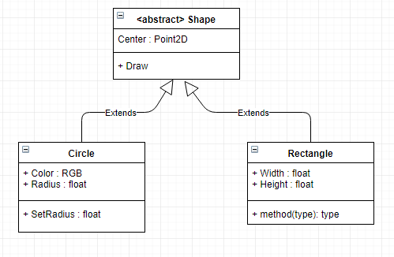

# Review 05 - Where we talk about memory

Throughout these tutorials, I've purposely shyed away from talking about memory as much as I possibly can,
doing a fair bit of hand-waving, talking about the size of structures, but avoiding talking about actual
allocation of things in C++.  In this review, I'm going to cover the intricacies of memory and memory management
in C++.

## Previously ...

Let's take a look at the 'boilerplate' code I have set up for a `main.cpp` file:

``` C++
enum Executables
{
    ex01 = 0,
    ex02,
    endoflist
};

void main()
{
    Executables toRun = ex02;

    switch (toRun)
    {
    case ex01:
    {
        break;
    }

    case ex02:
    {
        break;
    }

    default:
        break;
    }
}
```

I'm actually allocating memory in this code snippet. Where? Every time I allocate a variable. So `toRun` is
allocated, on the stack. It's done automatically for me byt the compiler.

But you hear all the time about C/C++ and memory leaks. Am I leaking memory here? How do I fix it?

Well, we're not leaking anything because of two things:

 1. The allocation is happening on the stack
 2. C/C++ scoping rules

When we allocate memory, we can allocate it from two places: the "stack" and the "heap". Every function that
you call creates it's own 'stack' memory space where it stores variables local to that function. It also stores
arguments passed in, and out of, the function during the invocation of said function.

We allocate memory from the heap via the `malloc`, `new` functions (and their variants). Anything we allocate from 
the heap, we eventually have to reclaim via `free` and `delete`, otherwise we end up with a memory leak. More on
that shortly.

We also need to talk about scoping rules. We've already seen C++ keywords that help with defining the scope of a
variable, when we looked at the `extern` keyword in "Review04". Remember, that allowed us to tell the compiler/linker
that the variable was declared elsewhere and the linker would resolve it. Let's talk more about this.  In "Review04", 
the allegro font variable we used (`extern ALLEGRO_FONT* gFont;`) was arguably a 'global' variable; with the right
keywords, you can access that variable anywhere in your application, in any file.

Does the same hold true for the variable `toRun` in the above example? No, it does not. There is no equivalent of
`main.toRun` that you can use to access that variable.  So this:

``` C++
enum Executables
{
    ex01 = 0,
    ex02,
    endoflist
};

void main()
{
    Executables toRun = ex02;

    switch (toRun)
    {
    case ex01:
    {
        break;
    }

    case ex02:
    {
        break;
    }

    default:
        break;
    }
}

void foo()
{
    main.toRun = ex01; // compile error
}
```

Fails to compile.

However, moving it out of `main()` promotes it to a more 'global' scope:

``` C++
enum Executables
{
    ex01 = 0,
    ex02,
    endoflist
};

Executables gToRun;

void main()
{
    gToRun = gToRun;

    switch (gToRun)
    {
    case ex01:
    {
        break;
    }

    case ex02:
    {
        break;
    }

    default:
        break;
    }
}

void foo()
{
    gToRun = ex01; // compiles fine
}

```

## Scoping points

Let's say we have a function with a loop:

``` C++
void foo()
{
    for (int index = 0; index < 10; index++)
    {
        printf("%i\n", index);
    }
    
    printf("%i\n", index);
}    

```

What do you think the output from that will be?


Trick question! It doesn't actually compile. Specifically with this error:

``` prompt
 In function 'void foo()':
43:17: error: 'index' was not declared in this scope
```

That error refers to:

``` C++
void foo()
{
    for (int index = 0; index < 10; index++)
    {
        printf("%i\n", index);
    }
    
    printf("%i\n", index);   // <<== error here
}    
```

The compiler can't find `index` because it is only scoped to the `for` loop - initializing the 
variable `index` inside the `for` loop automatically enforces the scope.

A quick change fixes this:
``` C++
void foo()
{
    int index = 0;
    for (; index < 10; index++)
    {
        printf("%i\n", index);
    }
    
    printf("%i\n", index);   // <<== error here
}    
```

But is that a change for the better? Depends on your needs. Initializing the `index` variable inside
the `for` loop automatically enforces cleanup of that variable; you don't have to worry about accidentally
reusing that variable. That's a good thing, IMO. You can now legally do the following:

``` C++
void foo()
{
    for (int index = 0; index < 10; index++)
    {
        printf("%i\n", index);
    }

    // do other stuff

    for (int index = 5; index < 10; index++)
    {
        // do something else here
    }
}    
```

You can actually enforce deeper scoping of variables using the curly braces:

``` C++
void foo()
{
    {
        int innerScope = 10;
        printf("innerScope: %d\n", innerScope);
    }
    
    {
        int innerScope = 20;
        printf("innerScope: %d\n", innerScope);
    }
}    
```

Each `innerScope` is scoped between it's curly braces. The following:

``` C++
void foo()
{
    {
        int innerScope = 10;
        printf("innerScope: %d\n", innerScope);
    }
    
    {
        int innerScope = 20;
        printf("innerScope: %d\n", innerScope);
    }
    
    printf("innerScope: %d\n", innerScope); // <<== error: 'innerScope' was not declared in this scope
}    
```

Fails with the error "'innerScope' was not declared in this scope".

So, what happens if we declare `innerScope` at the top of the function?

``` C++
void foo()
{
    int innerScope = 5;
    {
        int innerScope = 10;
        printf("innerScope: %d\n", innerScope);
    }
    
    {
        int innerScope = 20;
        printf("innerScope: %d\n", innerScope);
    }
    
    printf("innerScope: %d\n", innerScope);
}    
```

The results are:

``` prompt
innerScope: 10
innerScope: 20
innerScope: 5
```

Simply put, local scope overrides the parent scope.  Let's say you wanted to access the 'parent' scope of the variable `innerScope`.
We can use the "scope resoloution operator" to do that - it's the `::` operator. However, it is not applicable to the curly brace
scoping cheat.  An example helps clarify this:

``` C++
int innerScope = 2;
void foo()
{
    int innerScope = 5;
    {
        int innerScope = 10;
        printf("innerScope: %d\n", innerScope);
    }
    
    {
        int innerScope = 20;
        printf("innerScope: %d\n", innerScope);
        printf("outer innerScope: %d\n", ::innerScope);
    }
    
    printf("innerScope: %d\n", innerScope);
}    
```

Results in the output:

``` prompt
innerScope: 10
innerScope: 20
outer innerScope: 2
innerScope: 5
```

## More Scoping

Let's say we have a class called `Utility`. In it, we want to define some ... utility functions
Like the ability to test to see if a file exists.

Like this:

``` C++
#include <stdio.h>

// On windows, use <io.h> instead. And call _access(..) instead of access(..)_
#include <unistd.h>


class Utility
{
    public:
    static bool Exists(const char* filename)
    {
        bool result = false;
        if (access(filename, 0) == 0)
            result = true;
            
        return result;
    }
};

int main()
{
    printf("Does foo.txt exist? %s\n", Utility::Exists("foo.txt") ? "Yes" : "No");
}
```

And since we're running on a remote box, our result:

``` prompt
Does foo.txt exist? No
```

[link here](cpp.sh/5324)


Some points about what's going on here, as we've added a few things that you may not be familiar
with.

 1) The `Utility` class has one static function (classes tend to describe these as 'methods'). Because it's static, you don't have to initialize an instance of the class to use it.
 2) However, in order to use it, we have to use the scope resolution operator, along the the class name and the method name, to access it.
 3) The method we define must be defined as static for it to be used in this 'global' manner (without instantiating an instance of `Utility`).

That's all well and good, but is that the right way to do this? Maybe we want to have a `Utility` class that has a `File` class inside of it.
Can we do that? Is that a thing we can do in C++?

Let's try it!

``` C++
#include <stdio.h>
#include <unistd.h>

class Utility
{
    public:
    class File
    {
        public:
        static bool Exists(const char* filename)
        {
            bool result = false;
            if (access(filename, 0) == 0)
                result = true;
                
            return result;
        }
    };
};

int main()
{
    printf("Does foo.txt exist? %s\n", Utility::File::Exists("foo.txt") ? "Yes" : "No");
}
```

Running it in the C++ shell [here](cpp.sh/8yndj)?

``` prompt
Does foo.txt exist? No
```

Sweet Zombie Jesus it works!

And there's no real reason for it not to work. We're accessing something that's defined as `static`.

So, what does `static` actually mean?

From [cppreference.com](http://en.cppreference.com/w/cpp/language/static)

> Inside a class definition, the keyword static declares members that are not bound to class instances.

Is this the best way to implement this? Well, let's give you another option, so you can make up your
own mind. Let's re-write the class we just wrote using a `namespace` instead.

``` C++
#include <stdio.h>
#include <unistd.h>

namespace Utility
{
    class File
    {
        public:
        static bool Exists(const char* filename)
        {
            bool result = false;
            if (access(filename, 0) == 0)
                result = true;
                
            return result;
        }
    };
};

int main()
{
    printf("Does foo.txt exist? %s\n", Utility::File::Exists("foo.txt") ? "Yes" : "No");
}
```

[C++ Shell link](cpp.sh/55j4d)

The difference between the two implementations?

``` C++
// =======================
// Previous
class Utility
{
    public:
    class File

// =======================
// New
namespace Utility
{
    class File
```

That's the difference. Well, there are other differences ...

 1) The default visibility in a namespace is `public`. `classes` would be `private`, which is why we had the `public:` in the first definition`.
 2) `namespace` affords us another keyword, `using`. This allows us to do the following:

``` C++
// =======================
// Previous
int main()
{
    printf("Does foo.txt exist? %s\n", Utility::File::Exists("foo.txt") ? "Yes" : "No");

// =======================
// New
using namespace Utility;

int main()
{
    printf("Does foo.txt exist? %s\n", File::Exists("foo.txt") ? "Yes" : "No");
}
```

[C++ Shell link](cpp.sh/43szr)

And we get the same output. Why would this be a better solution? Well, for starters, if we had multiple
calls to `File::WhateverMethod`, it saves us some typing.  Is that a big deal?

Well ...

If you've done any digging on the internet for C++ tutorials, you've probably seen a lot of tutorials using
something akin to: `cout << "Here is a string" << endl;`

`cout` and `endl` live in the Standard library and are in the namespace `std`. Which means you'd need to
actually do this: `std::cout << "Here is a string" << std::endl;`

Like so:

``` C++
// Example program
#include <iostream>

void PrintMe()
{
    using namespace std;
    cout << "Here is some text" << endl;
}

void PrintMeAgain()
{
    std::cout << "Here is some more text" << std::endl;
}

int main()
{
    PrintMe();
    PrintMeAgain();
}
```

``` prompt
Here is some text
Here is some more text
```

[C++ Shell Link](cpp.sh/2om5s)

So, what do we use? Here's a rule I like to go by:

> If what we're designing needs to _only_ have a scope, then a `namespace` is the right choice. Remember that a `class` is a type, and by definition requires data. So if it smells like data, then it's a class.

This is a crazy oversimplification of the process I have in my head, but I think it holds up 90% of the time.

## MEMORY!!!

That's been a fairly long setup to get to this point - a program that actually allocates memory. I've use C++ Shell
a lot to help kickstart some simple concepts, but this next bit is going to use Allegro, so we will be referencing
the `Review05` project.

### !!!WARNING!!! The following code is purely for educational purposes ONLY!

I can't stress this enough - the code you are about to see is only for educational purposes. If you were to
write production code this way, you should be publicly reprimanded for it.

Anyway ...

I'm going to create a simple application that creates a random shape on-screen depending on where
you click on the mouse. We won't have any idea how many elements we're going to create beforehand
so we will be dynamically allocating them!  There will also be a lot of code to do this. But I'm
going to err on the side of verbosity and clarity, rather than performance (read - it's going to
be far from optimal).

### Design

I'll do a little bit of inheritance here to help illustrate some more OOP idioms. This means
I'll end up with a set of classes that, in UML, looks like this:



`Shape` will be an abstract class, with two classes derived from it, `Circle` and `Rectangle`.