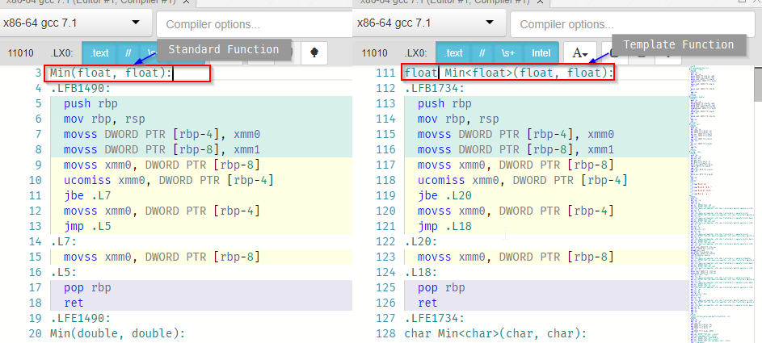

Intermediate C++ 01 - Templates
***********************************************************************************************************************
Summary
=======================================================================================================================
I am not a master of Templates in C++. This is by design on my part. I personally find that they have very limited use.
That's not a commonly shared opinion, to be honest with the reader, so I'm taking it upon myself to see if it's just my
own personal prejudice or if it's something that my gut check has been accurate about.

What are Templates in C++
=======================================================================================================================
Templates are a way of performing operations on 'generic' data types. That's pretty much it.

So, for example, say we wanted to create a function like so:

.. code-block:: C++

    anytype Min(anytype valueA, anytype valueB)
    {
        return valueA < valueB ? valueA : valueB;
    }

So if we run this function on a ``float`` or ``int`` or ``double`` or even ``char`` data type, it will just work, 
without having to create specialized versions of the same code. Without templates, you'd have to do either:

.. code-block:: C++

    float Min(float valueA, float valueB)
    {
        return valueA < valueB ? valueA : valueB;
    }

    double Min(double valueA, double valueB)
    {
        return valueA < valueB ? valueA : valueB;
    }

    int Min(int valueA, int valueB)
    {
        return valueA < valueB ? valueA : valueB;
    }

    char Min(char valueA, char valueB)
    {
        return valueA < valueB ? valueA : valueB;
    }
        
or we do it as a macro:

.. code-block:: C++

    #define MIN(valueA, valueB) \
        ((valueA < valueB) ? valueA : valueB)

`Here's the above in C++ <cpp.sh/73gde>`_

So, how would we do that in a 'template' way? It's actually very, very easy:

.. code-block:: C++

    template<typename T>
    T Min(T valueA, T valueB)
    {
        return valueA < valueB ? valueA : valueB;
    }

`In practice, here's the version templated <cpp.sh/8ofhs>`_

OK, so ... what's the problem with that? I mean, that looks pretty sweet, right?

Well, let's see what it looks like when it's compiled. First off, what does it look like as functions?

.. code-block:: assembly

    main:
     .LFB1494:
        push rbp
        mov rbp, rsp
        push rbx
        sub rsp, 24
        mov esi, OFFSET FLAT:.LC0
        mov edi, OFFSET FLAT:std::cout
        call std::basic_ostream<char, std::char_traits<char> >& std::operator<< <std::char_traits<char> >(std::basic_ostream<char, std::char_traits<char> >&, char const*)
        mov esi, 8
        mov rdi, rax
        call std::basic_ostream<char, std::char_traits<char> >::operator<<(int)
        mov esi, OFFSET FLAT:std::basic_ostream<char, std::char_traits<char> >& std::endl<char, std::char_traits<char> >(std::basic_ostream<char, std::char_traits<char> >&)
        mov rdi, rax
        call std::basic_ostream<char, std::char_traits<char> >::operator<<(std::basic_ostream<char, std::char_traits<char> >& (*)(std::basic_ostream<char, std::char_traits<char> >&))
        mov esi, OFFSET FLAT:.LC0
        mov edi, OFFSET FLAT:std::cout
        call std::basic_ostream<char, std::char_traits<char> >& std::operator<< <std::char_traits<char> >(std::basic_ostream<char, std::char_traits<char> >&, char const*)
        mov rbx, rax
        mov esi, 8
        mov edi, 10
        call Min(int, int)
        mov esi, eax
        mov rdi, rbx
        call std::basic_ostream<char, std::char_traits<char> >::operator<<(int)
        mov esi, OFFSET FLAT:std::basic_ostream<char, std::char_traits<char> >& std::endl<char, std::char_traits<char> >(std::basic_ostream<char, std::char_traits<char> >&)
        mov rdi, rax
        call std::basic_ostream<char, std::char_traits<char> >::operator<<(std::basic_ostream<char, std::char_traits<char> >& (*)(std::basic_ostream<char, std::char_traits<char> >&))
        mov esi, OFFSET FLAT:.LC1
        mov edi, OFFSET FLAT:std::cout
        call std::basic_ostream<char, std::char_traits<char> >& std::operator<< <std::char_traits<char> >(std::basic_ostream<char, std::char_traits<char> >&, char const*)
        mov rbx, rax
        movsd xmm0, QWORD PTR .LC2[rip]
        mov rax, QWORD PTR .LC3[rip]
        movapd xmm1, xmm0
        mov QWORD PTR [rbp-24], rax
        movsd xmm0, QWORD PTR [rbp-24]
        call Min(double, double)
        mov rdi, rbx
        call std::basic_ostream<char, std::char_traits<char> >::operator<<(double)
        mov esi, OFFSET FLAT:std::basic_ostream<char, std::char_traits<char> >& std::endl<char, std::char_traits<char> >(std::basic_ostream<char, std::char_traits<char> >&)
        mov rdi, rax
        call std::basic_ostream<char, std::char_traits<char> >::operator<<(std::basic_ostream<char, std::char_traits<char> >& (*)(std::basic_ostream<char, std::char_traits<char> >&))
        mov esi, OFFSET FLAT:.LC4
        mov edi, OFFSET FLAT:std::cout
        call std::basic_ostream<char, std::char_traits<char> >& std::operator<< <std::char_traits<char> >(std::basic_ostream<char, std::char_traits<char> >&, char const*)
        mov rbx, rax
        movss xmm1, DWORD PTR .LC5[rip]
        movss xmm0, DWORD PTR .LC6[rip]
        call Min(float, float)
        mov rdi, rbx
        call std::basic_ostream<char, std::char_traits<char> >::operator<<(float)
        mov esi, OFFSET FLAT:std::basic_ostream<char, std::char_traits<char> >& std::endl<char, std::char_traits<char> >(std::basic_ostream<char, std::char_traits<char> >&)
        mov rdi, rax
        call std::basic_ostream<char, std::char_traits<char> >::operator<<(std::basic_ostream<char, std::char_traits<char> >& (*)(std::basic_ostream<char, std::char_traits<char> >&))
        mov esi, OFFSET FLAT:.LC7
        mov edi, OFFSET FLAT:std::cout
        call std::basic_ostream<char, std::char_traits<char> >& std::operator<< <std::char_traits<char> >(std::basic_ostream<char, std::char_traits<char> >&, char const*)
        mov rbx, rax
        mov esi, 97
        mov edi, 65
        call Min(char, char)
        movsx eax, al
        mov esi, eax
        mov rdi, rbx
        call std::basic_ostream<char, std::char_traits<char> >& std::operator<< <std::char_traits<char> >(std::basic_ostream<char, std::char_traits<char> >&, char)
        mov esi, OFFSET FLAT:std::basic_ostream<char, std::char_traits<char> >& std::endl<char, std::char_traits<char> >(std::basic_ostream<char, std::char_traits<char> >&)
        mov rdi, rax
        call std::basic_ostream<char, std::char_traits<char> >::operator<<(std::basic_ostream<char, std::char_traits<char> >& (*)(std::basic_ostream<char, std::char_traits<char> >&))
        mov eax, 0
        add rsp, 24
        pop rbx
        pop rbp
        ret

To break it down, let's look at this:

.. code-block:: assembly

    call std::basic_ostream<char, std::char_traits<char> >& std::operator<< <std::char_traits<char> >(std::basic_ostream<char, std::char_traits<char> >&, char const*)
    mov rbx, rax
    mov esi, 8
    mov edi, 10
    call Min(int, int)  <<== we simply invoke the function
    mov esi, eax
    mov rdi, rbx
    call std::basic_ostream<char, std::char_traits<char> >::operator<<(int)

`Here's the assembly for this <https://godbolt.org/g/VhdsYn>`_

What happens when we use a template version?

.. code-block:: assembly

    main:
     .LFB1491:
       push rbp
       mov rbp, rsp
       push rbx
       sub rsp, 24
       mov esi, OFFSET FLAT:.LC0
       mov edi, OFFSET FLAT:std::cout
       call std::basic_ostream<char, std::char_traits<char> >& std::operator<< <std::char_traits<char> >(std::basic_ostream<char, std::char_traits<char> >&, char const*)
       mov rbx, rax
       mov esi, 8
       mov edi, 10
       call int Min<int>(int, int)
       mov esi, eax
       mov rdi, rbx
       call std::basic_ostream<char, std::char_traits<char> >::operator<<(int)
       mov esi, OFFSET FLAT:std::basic_ostream<char, std::char_traits<char> >& std::endl<char, std::char_traits<char> >(std::basic_ostream<char, std::char_traits<char> >&)
       mov rdi, rax
       call std::basic_ostream<char, std::char_traits<char> >::operator<<(std::basic_ostream<char, std::char_traits<char> >& (*)(std::basic_ostream<char, std::char_traits<char> >&))
       mov esi, OFFSET FLAT:.LC1
       mov edi, OFFSET FLAT:std::cout
       call std::basic_ostream<char, std::char_traits<char> >& std::operator<< <std::char_traits<char> >(std::basic_ostream<char, std::char_traits<char> >&, char const*)
       mov rbx, rax
       movsd xmm0, QWORD PTR .LC2[rip]
       mov rax, QWORD PTR .LC3[rip]
       movapd xmm1, xmm0
       mov QWORD PTR [rbp-24], rax
       movsd xmm0, QWORD PTR [rbp-24]
       call double Min<double>(double, double)
       mov rdi, rbx
       call std::basic_ostream<char, std::char_traits<char> >::operator<<(double)
       mov esi, OFFSET FLAT:std::basic_ostream<char, std::char_traits<char> >& std::endl<char, std::char_traits<char> >(std::basic_ostream<char, std::char_traits<char> >&)
       mov rdi, rax
       call std::basic_ostream<char, std::char_traits<char> >::operator<<(std::basic_ostream<char, std::char_traits<char> >& (*)(std::basic_ostream<char, std::char_traits<char> >&))
       mov esi, OFFSET FLAT:.LC4
       mov edi, OFFSET FLAT:std::cout
       call std::basic_ostream<char, std::char_traits<char> >& std::operator<< <std::char_traits<char> >(std::basic_ostream<char, std::char_traits<char> >&, char const*)
       mov rbx, rax
       movss xmm1, DWORD PTR .LC5[rip]
       movss xmm0, DWORD PTR .LC6[rip]
       call float Min<float>(float, float)
       mov rdi, rbx
       call std::basic_ostream<char, std::char_traits<char> >::operator<<(float)
       mov esi, OFFSET FLAT:std::basic_ostream<char, std::char_traits<char> >& std::endl<char, std::char_traits<char> >(std::basic_ostream<char, std::char_traits<char> >&)
       mov rdi, rax
       call std::basic_ostream<char, std::char_traits<char> >::operator<<(std::basic_ostream<char, std::char_traits<char> >& (*)(std::basic_ostream<char, std::char_traits<char> >&))
       mov esi, OFFSET FLAT:.LC7
       mov edi, OFFSET FLAT:std::cout
       call std::basic_ostream<char, std::char_traits<char> >& std::operator<< <std::char_traits<char> >(std::basic_ostream<char, std::char_traits<char> >&, char const*)
       mov rbx, rax
       mov esi, 97
       mov edi, 65
       call char Min<char>(char, char)
       movsx eax, al
       mov esi, eax
       mov rdi, rbx
       call std::basic_ostream<char, std::char_traits<char> >& std::operator<< <std::char_traits<char> >(std::basic_ostream<char, std::char_traits<char> >&, char)
       mov esi, OFFSET FLAT:std::basic_ostream<char, std::char_traits<char> >& std::endl<char, std::char_traits<char> >(std::basic_ostream<char, std::char_traits<char> >&)
       mov rdi, rax
       call std::basic_ostream<char, std::char_traits<char> >::operator<<(std::basic_ostream<char, std::char_traits<char> >& (*)(std::basic_ostream<char, std::char_traits<char> >&))
       mov eax, 0
       add rsp, 24
       pop rbx
       pop rbp
       ret

`Here's what the assembly for that looks like <https://godbolt.org/g/zoZ3Yw>`_

Again, let's look at a smaller section:

.. code-block:: assembly

    call std::basic_ostream<char, std::char_traits<char> >& std::operator<< <std::char_traits<char> >(std::basic_ostream<char, std::char_traits<char> >&, char const*)
    mov rbx, rax
    mov esi, 8
    mov edi, 10
    call int Min<int>(int, int)
    mov esi, eax
    mov rdi, rbx
    call std::basic_ostream<char, std::char_traits<char> >::operator<<(int)

That looks ... surprisingly similar.

Let's compare side by side

.. code-block:: assembly

    call std::basic_ostream<char,                    | call std::basic_ostream<char, 
        std::char_traits<char> >&                    |     std::char_traits<char> >& 
        std::operator<< <std::char_traits<char> >    |     std::operator<< <std::char_traits<char> >
        (std::basic_ostream<char,                    |     (std::basic_ostream<char, 
        std::char_traits<char> >&, char const*)      |     std::char_traits<char> >&, char const*)
    mov rbx, rax                                     | mov rbx, rax                                 
    mov esi, 8                                       | mov esi, 8                                   
    mov edi, 10                                      | mov edi, 10                                  
    call Min(int, int)                               | call int Min<int>(int, int)                  
    mov esi, eax                                     | mov esi, eax                                 
    mov rdi, rbx                                     | mov rdi, rbx                                 
    call std::basic_ostream<char,                    | call std::basic_ostream<char,                
        std::char_traits<char> >::operator<<(int)    |     std::char_traits<char> >::operator<<(int)

That is ... nearly identical. The difference is here:

.. code-block:: assembly

    call Min(int, int)                               | call int Min<int>(int, int)                  

So ... what does ``call int Min<int>(int, int)`` mean?

It means the same thing as ``call Min(int, int)`` - the ``Min(int, int)`` is the function signature. In the 
``call int Min<int>(int, int)`` example, the ``int Min<int>(int, int)`` is the function signature. So it is
doing a call into a function. This was not what I was expecting, as I thought it would inline the assembly
at the call site. - I've always been under the assumption that templates lead to code bloat.  I may have been under
a false assumption there.

I mean, let's look at the code:

Those are identical. So that's one theory out the window.

OK, so what else bugs me about template functions. Well, there's the whole "if you don't invoke it, you don't compile
it" part of templates. By that I mean, if you don't actually call a function template, it doesn't actually get 
compiled.

For instance ...

.. code-block:: C++

    // Example program
    #include <iostream>
    #include <string>

    template<typename T>
    T Min(T valueA, T valueB)
    {
        return valueA < valueB ? valueA : valueB;
    }    

    template<typename T>
    T Max(T valueA, T valueB)
    {
        return valueA > valueB ? valueA : valueB;
    }    
        
    int main()
    {
    std::cout << "Min(8, 10): " << Min(10, 8) << std::endl;
    std::cout << "Min(8.0, 10.0): " << Min(10.0, 8.0) << std::endl;
    std::cout << "Min(8.0f, 10.0f): " << Min(10.0f, 8.0f) << std::endl;
    std::cout << "Min('A', 'a'): " << Min('A', 'a') << std::endl;
    }

if you check out the `Code explorer version here <https://godbolt.org/g/6joZpb>`_, you'll see that the template code
isn't actually compiled into the exe. But isn't that a good thing? I mean, that's less bloat!

Template code that isn't used doesn't get compiled. That means you can introduce a compiler error and it won't get 
caught unless you utilize the function! So, let's take a look at the same example, but with an error introduced into
the ``Max`` function. Let's rename ``return valueA > valueB ? valueA : valueB;`` to 
``return valueC > valueB ? valueA : valueB;`` and see the compiler happily compile it without error:

`And the results are ... not what I expected!! <https://godbolt.org/g/6K5deA>`_

The hells? That failed to compile! Am I nuts? That's never called. So that shouldn't have been compiled!

*Goes off to try it with the Microsoft compiler*

OK, I'm not crazy. In Microsoft Visual C++ (2015), that compiles without error. OR WARNING!

Don't beleve me? Go and add

.. code-block:: C++

    template<typename T>
    T Max(T valueA, T valueB)
    {
        return valueA > valueB ? valueA : valueB;
    }

into any of the existing code we've built in Visual C++. I'll wait.

So, it takes a bit of jigging to get it to work correctly. I'll build a review at some point in time to talk about it.
However, we end up with this for the assembly (in Debug) for the template:

.. code-block:: assembly

    --- d:\dev\bagofholding\programmingincpp\templates01\main.cpp ------------------
    // Example program
    #include <iostream>
    #include <string>

    template<typename T>
    T Min(T valueA, T valueB)
    {
    00007FF6566622B0  mov         dword ptr [rsp+10h],edx  
    00007FF6566622B4  mov         dword ptr [rsp+8],ecx  
    00007FF6566622B8  push        rbp  
    00007FF6566622B9  push        rdi  
    00007FF6566622BA  sub         rsp,0D8h  
    00007FF6566622C1  mov         rbp,rsp  
    00007FF6566622C4  mov         rdi,rsp  
    00007FF6566622C7  mov         ecx,36h  
    00007FF6566622CC  mov         eax,0CCCCCCCCh  
    00007FF6566622D1  rep stos    dword ptr [rdi]  
    00007FF6566622D3  mov         ecx,dword ptr [rsp+0F8h]  
        return valueA < valueB ? valueA : valueB;
    00007FF6566622DA  mov         eax,dword ptr [valueB]  
    00007FF6566622E0  cmp         dword ptr [valueA],eax  
    00007FF6566622E6  jge         Min<int>+46h (07FF6566622F6h)  
    00007FF6566622E8  mov         eax,dword ptr [valueA]  
    00007FF6566622EE  mov         dword ptr [rbp+0C0h],eax  
    00007FF6566622F4  jmp         Min<int>+52h (07FF656662302h)  
    00007FF6566622F6  mov         eax,dword ptr [valueB]  
    00007FF6566622FC  mov         dword ptr [rbp+0C0h],eax  
    00007FF656662302  mov         eax,dword ptr [rbp+0C0h]  
    }

And it's invoked like so:

.. code-block:: assembly

    int main()
    {
    00007FF656662B70  push        rbp  
    00007FF656662B72  push        rdi  
    00007FF656662B73  sub         rsp,0F8h  
    00007FF656662B7A  lea         rbp,[rsp+20h]  
    00007FF656662B7F  mov         rdi,rsp  
    00007FF656662B82  mov         ecx,3Eh  
    00007FF656662B87  mov         eax,0CCCCCCCCh  
    00007FF656662B8C  rep stos    dword ptr [rdi]  
        std::cout << "Min(8, 10): " << Min(10, 8) << std::endl;
    00007FF656662B8E  mov         edx,8  
    00007FF656662B93  mov         ecx,0Ah  
    00007FF656662B98  call        Min<int> (07FF656661055h)  
    00007FF656662B9D  mov         dword ptr [rbp+0C0h],eax  
    00007FF656662BA3  lea         rdx,[string "Min(8, 10): " (07FF65666AD98h)]  
    00007FF656662BAA  mov         rcx,qword ptr [__imp_std::cout (07FF656671150h)]  
    00007FF656662BB1  call        std::operator<<<std::char_traits<char> > (07FF65666113Bh)  
    00007FF656662BB6  mov         ecx,dword ptr [rbp+0C0h]  
        std::cout << "Min(8, 10): " << Min(10, 8) << std::endl;
    00007FF656662BBC  mov         edx,ecx  
    00007FF656662BBE  mov         rcx,rax  
    00007FF656662BC1  call        qword ptr [__imp_std::basic_ostream<char,std::char_traits<char> >::operator<< (07FF656671178h)]  
    00007FF656662BC7  lea         rdx,[std::endl<char,std::char_traits<char> > (07FF6566610B9h)]  
    00007FF656662BCE  mov         rcx,rax  
    00007FF656662BD1  call        qword ptr [__imp_std::basic_ostream<char,std::char_traits<char> >::operator<< (07FF656671180h)]  

You can find the source for this in the ``Templates01.vcxproj`` project.

This illustrates another issue - don't assume all compilers handle templates the same way.  I now want to see what
this is going to look like compiled with the Microsoft tools.  Let's do that.

