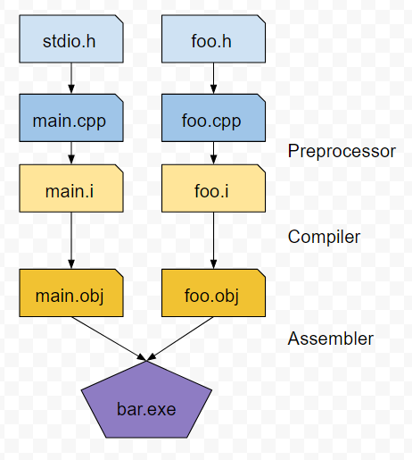
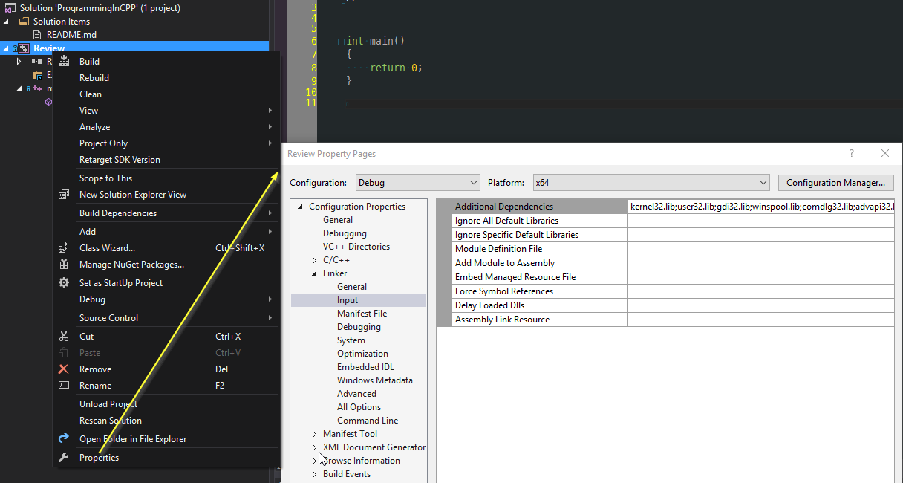

Where we talk about the Generating code
******************************************

Summary
==========================================
For a lot of folks coming in from other, more modern languages, the process of creating an executable, library or DLL
in the C++ ecosystem is a little foreign in the days of JIT compilers and scripting languages. It does have it's perils
as it can be a slow build process on larger codebases (compared to C#) but there is an elegance about it.

Take, for instance, the following C++ code

.. code-block:: C++

    #include <stdio.h>

    int main()
    {
        printf("Hello World\n");
    }

You can take that code, verbatim, and fire it into the C++ shell here `C++ Shell <http://cpp.sh/7jiaj>`_ and you see the output
in the execution window.

But that is obfuscating a lot of what's happening under the hood.

#. First off, the compiler takes a look at the source code. It generates an `.obj` file which is an 'intermeditate' file. You can think of it as 'mostly' machine code, but it has additional information associated with it that is used by the next step, the Linker.
#. The linker takes a set of `.obj` files, as well as any library files, and combines them into a final, resultant file. This final file can be an executable, another library, or a DLL.

Now, that is an incredibly simple overview of what's going on. Let's actually talk about what's really happening there. Let's assume a more complex project, that contains a set of source files (a large set of `.cpp` files)

The C++ Preprocessor
==========================================
The C++ preprocessor takes the source file and expands all the `preprocessor` directives in your code. The simplest definition of a preprocessor directive is - take a look at any line that starts with a `#` - the operation that follows that is expanded inline in the code base. So, for the `#include <stdio.h>` line, the contents of the file `stdio.h` are essentially copied and pasted into the source file.

Now, the C++ preprocessor can do a *lot* of things. We'll talk about that later, because it's incredibly important. Just be aware that it's one of the foundational pieces of the C++ language.

Compiler
==========================================
Each expanded source file is then compiled into the assembly language/machine code for the desired platform as an '.obj' file. A compiler can generate assembly language for multiple architectures, if it's capable of doing so. The compiler will also inject additional information about functions, classes and a few other bits, for the next stage

Linker
==========================================
Now that we have individual `.obj` files for each source file, the linker now takes all the individual pieces and Links them together into one piece. This can be an executable, a library, or a DLL.

The other thing to note is that the Linker will also link in other 'things' from external libraries. Remember in the example 'hello world' source, we call the function `printf("Hello World\n");`? Well, `printf` isn't a function that's native to the C++ language. It's defined in an external Library and it's function signature is defined through `stdio.h`.

Visually, it kind of looks like this process:

The next question is, how does the compiler know how to find the actual source code for the function `printf`? Trust me (or go look yourself), it's not declared in `stdio.h`. We know that the linker will eventually resolve it into a library, but how do we tell the compiler what library to use? We're lucky in Visual Studio, there's a nice dialog for that:

In other build environments, those compiler options can be passed through on the command line, through a make file, or another build system (I expect XCode does something similar to Visual Studio).

More details
------------------------------------------
I'm being purposely obtuse about the format of the files the compiler/linker generates. I feel that's outside of the scope of this tutorial. However, it is something that is worth noting as there are multiple formats depending on the Operating System (ELF, COFF, PE32+ for example). I'll point you here to start the investigation if you're truly interested: [wikipedia](https://en.wikipedia.org/wiki/Object_file)

Examining an incredibly simple program
==========================================
In the source code for this tutorial, I have a very simple example program that consists of multiple files.

- `main.cpp` = This is the main entry point into our application
- `functions.h` = This is the definitions of functions we are exposing
- `functions.cpp` = this is the declaration of the functions we are using.

There's a bit there, so let's walk through this:

We have the main entry point in `main.cpp` via the `int main()` function declaration. In this we call a few external functions. Most notably, we call our own function, `Fibbonaci` to calculate a Fibbonaci series recursively. The other functions are part of the standard library (not the STL).

.. code-block:: C++

    // ProgrammingInCPP.cpp : Defines the entry point for the console application.
    //

    #include <stdio.h>
    #include "Functions.h"

    int main()
    {
        for (unsigned int index = 0; index < 10; index++)
        {
            printf("The Fibbonaci series of %d is %d\n", index, Fibbonaci(index));
        }

        printf("press any key to continue");
        scanf("-");
        return 0;
    }

Also note that we include the `Functions.h` header file. To be 100% explicit, this has the *exact* same functionality of injecting the contents of the file into `main.cpp` like so:

.. code-block:: C++

    // ProgrammingInCPP.cpp : Defines the entry point for the console application.
    //

    #include <stdio.h>
    #pragma once

    unsigned int Fibbonaci(unsigned int i);

    int main()
    {
        for (unsigned int index = 0; index < 10; index++)
        {
            printf("The Fibbonaci series of %d is %d\n", index, Fibbonaci(index));
        }

        printf("press any key to continue");
        scanf("-");
        return 0;
    }

To repeat, you could physically copy the contents of the file `Functions.h` and replace `#include "Functions.h"` with those contents. Go ahead. Try it. See what you get.  And then revert it ;)

What, then, is the purpose of the `Functions.h` header file? This is where we declare the signature of a function, class, template, etc that can be referenced elsewhere. To stress this - we are defining the signature of the function `Fibbonacci` in this case. We do not actually define the implementation of that function.

Finally, we have the file `Functions.cpp`. This is where we define the implementation. Also note that I do not have any headers in this file:

.. code-block:: C++

    unsigned int Fibbonaci(unsigned int i)
    {
        if (i <= 1)
            return i;

        return Fibbonaci(i - 1) + Fibbonaci(i - 2);
    }

In this case, I don't need to include any headers as I am not referencing any external functions. Also note that the C++ compiler cannot 'look ahead' to infer functions/classes that are defined later in the file. If you need to reference a function/class, you are going to need to declare it before it's used.  This is why you'll see a header file for a `.cpp` file included - it does the `forward declarations` of those functions/classes for you.

OK, what else do we have in this `Fibbonacci` function implementation? 

- we have simple return types defined
- we have an example of a simple argument passed into the function
- we have a conditional in the form of an `if` statement
- we have an example of recursion, where the function calls itself.

I don't think I need to review how recursion works. If I'm wrong, please let me know.

To Summarize
=======================================================
This is a pretty quick tutorial. I've covered some fairly straightforward concepts here. In the next example, we'll actually discuss the language basics.

What we haven't reviewed
=======================================================
I'm leaving it to the reader to understand how to compile the project. This is a Visual Studio 2015 solution/project. Visual Studio 2015 Community Edition was used in the development of this example project.

Enjoy for now.