Review 05 - Where we talk about memory
***********************************************************************************************************************
Summary
=======================================================================================================================
Throughout these tutorials, I've purposely shyed away from talking about memory as much as I possibly can,
doing a fair bit of hand-waving, talking about the size of structures, but avoiding talking about actual
allocation of things in C++.  In this review, I'm going to cover the intricacies of memory and memory management
in C++.

Previously ...
=======================================================================================================================
Let's take a look at the 'boilerplate' code I have set up for a ``main.cpp`` file:

.. code-block:: C++

    enum Executables
    {
        ex01 = 0,
        ex02,
        endoflist
    };

    void main()
    {
        Executables toRun = ex02;

        switch (toRun)
        {
        case ex01:
        {
            break;
        }

        case ex02:
        {
            break;
        }

        default:
            break;
        }
    }

I'm actually allocating memory in this code snippet. Where? Every time I allocate a variable. So ``toRun`` is 
allocated, on the stack. It's done automatically for me byt the compiler.

But you hear all the time about C/C++ and memory leaks. Am I leaking memory here? How do I fix it?

Well, we're not leaking anything because of two things:

 1. The allocation is happening on the stack
 2. C/C++ scoping rules

When we allocate memory, we can allocate it from two places: the "stack" and the "heap". Every function that you call 
creates it's own 'stack' memory space where it stores variables local to that function. It also stores arguments passed 
in, and out of, the function during the invocation of said function.

We allocate memory from the heap via the ``malloc``, ``new`` functions (and their variants). Anything we allocate from 
the heap, we eventually have to reclaim via ``free`` and ``delete``, otherwise we end up with a memory leak. More on
that shortly.

We also need to talk about scoping rules. We've already seen C++ keywords that help with defining the scope of a
variable, when we looked at the ``extern`` keyword in "Review04". Remember, that allowed us to tell the compiler/linker
that the variable was declared elsewhere and the linker would resolve it. Let's talk more about this.  In "Review04", 
the allegro font variable we used (``extern ALLEGRO_FONT* gFont;``) was arguably a 'global' variable; with the right
keywords, you can access that variable anywhere in your application, in any file.

Does the same hold true for the variable ``toRun`` in the above example? No, it does not. There is no equivalent of
``main.toRun`` that you can use to access that variable.  So this:

.. code-block:: C++

    enum Executables
    {
        ex01 = 0,
        ex02,
        endoflist
    };

    void main()
    {
        Executables toRun = ex02;

        switch (toRun)
        {
        case ex01:
        {
            break;
        }

        case ex02:
        {
            break;
        }

        default:
            break;
        }
    }

    void foo()
    {
        main.toRun = ex01; // compile error
    }

Fails to compile.

However, moving it out of ``main()`` promotes it to a more 'global' scope:

.. code-block:: C++

    enum Executables
    {
        ex01 = 0,
        ex02,
        endoflist
    };

    Executables gToRun;

    void main()
    {
        gToRun = gToRun;

        switch (gToRun)
        {
        case ex01:
        {
            break;
        }

        case ex02:
        {
            break;
        }

        default:
            break;
        }
    }

    void foo()
    {
        gToRun = ex01; // compiles fine
    }

Scoping points
=======================================================================================================================
Let's say we have a function with a loop:

.. code-block:: C++

    void foo()
    {
        for (int index = 0; index < 10; index++)
        {
            printf("%i\n", index);
        }
        
        printf("%i\n", index);
    }    

What do you think the output from that will be?

Trick question! It doesn't actually compile. Specifically with this error:

.. code-block:: doscon

    In function 'void foo()':
    43:17: error: 'index' was not declared in this scope

That error refers to:

.. code-block:: C++

    void foo()
    {
        for (int index = 0; index < 10; index++)
        {
            printf("%i\n", index);
        }
        
        printf("%i\n", index);   // <<== error here
    }    

The compiler can't find ``index`` because it is only scoped to the ``for`` loop - initializing the variable ``index`` 
inside the ``for`` loop automatically enforces the scope.

A quick change fixes this:

.. code-block:: C++

    void foo()
    {
        int index = 0;
        for (; index < 10; index++)
        {
            printf("%i\n", index);
        }
        
        printf("%i\n", index);   // <<== error here
    }    

But is that a change for the better? Depends on your needs. Initializing the ``index`` variable inside the ``for`` loop 
automatically enforces cleanup of that variable; you don't have to worry about accidentally reusing that variable. 
That's a good thing, IMO. You can now legally do the following:

.. code-block:: C++

    void foo()
    {
        for (int index = 0; index < 10; index++)
        {
            printf("%i\n", index);
        }

        // do other stuff

        for (int index = 5; index < 10; index++)
        {
            // do something else here
        }
    }    

You can actually enforce deeper scoping of variables using the curly braces:

.. code-block:: C++

    void foo()
    {
        {
            int innerScope = 10;
            printf("innerScope: %d\n", innerScope);
        }
        
        {
            int innerScope = 20;
            printf("innerScope: %d\n", innerScope);
        }
    }    

Each ``innerScope`` is scoped between it's curly braces. The following:

.. code-block:: C++

    void foo()
    {
        {
            int innerScope = 10;
            printf("innerScope: %d\n", innerScope);
        }
        
        {
            int innerScope = 20;
            printf("innerScope: %d\n", innerScope);
        }
        
        printf("innerScope: %d\n", innerScope); // <<== error: 'innerScope' was not declared in this scope
    }    

Fails with the error "'innerScope' was not declared in this scope".

So, what happens if we declare ``innerScope`` at the top of the function?

.. code-block:: C++

    void foo()
    {
        int innerScope = 5;
        {
            int innerScope = 10;
            printf("innerScope: %d\n", innerScope);
        }
        
        {
            int innerScope = 20;
            printf("innerScope: %d\n", innerScope);
        }
        
        printf("innerScope: %d\n", innerScope);
    }    

The results are:

.. code-block:: doscon

    innerScope: 10
    innerScope: 20
    innerScope: 5

Simply put, local scope overrides the parent scope.  Let's say you wanted to access the 'parent' scope of the variable 
``innerScope``. We can use the "scope resoloution operator" to do that - it's the ``::`` operator. However, it is not 
applicable to the curly brace scoping cheat.  An example helps clarify this:

.. code-block:: C++

    int innerScope = 2;
    void foo()
    {
        int innerScope = 5;
        {
            int innerScope = 10;
            printf("innerScope: %d\n", innerScope);
        }
        
        {
            int innerScope = 20;
            printf("innerScope: %d\n", innerScope);
            printf("outer innerScope: %d\n", ::innerScope);
        }
        
        printf("innerScope: %d\n", innerScope);
    }    

Results in the output:

.. code-block:: doscon

    innerScope: 10
    innerScope: 20
    outer innerScope: 2
    innerScope: 5

More Scoping
=======================================================================================================================
Let's say we have a class called ``Utility``. In it, we want to define some ... utility functions.

Like the ability to test to see if a file exists.

Like this:

.. code-block:: C++

    #include <stdio.h>

    // On windows, use <io.h> instead. And call _access(..) instead of access(..)_
    #include <unistd.h>

    class Utility
    {
        public:
        static bool Exists(const char* filename)
        {
            bool result = false;
            if (access(filename, 0) == 0)
                result = true;
                
            return result;
        }
    };

    int main()
    {
        printf("Does foo.txt exist? %s\n", Utility::Exists("foo.txt") ? "Yes" : "No");
    }

And since we're running on a remote box, our result:

.. code-block:: doscon

    Does foo.txt exist? No

`link here <cpp.sh/5324>`_

Some points about what's going on here, as we've added a few things that you may not be familiar
with.

 1. The ``Utility`` class has one static function (classes tend to describe these as 'methods'). Because it's static, 
    you don't have to initialize an instance of the class to use it.
 2. However, in order to use it, we have to use the scope resolution operator, along the the class name and the method 
    name, to access it.
 3. The method we define must be defined as static for it to be used in this 'global' manner (without instantiating an 
    instance of ``Utility``).

That's all well and good, but is that the right way to do this? Maybe we want to have a ``Utility`` class that has a 
``File`` class inside of it. Can we do that? Is that a thing we can do in C++?

Let's try it!

.. code-block:: C++

    #include <stdio.h>
    #include <unistd.h>

    class Utility
    {
        public:
        class File
        {
            public:
            static bool Exists(const char* filename)
            {
                bool result = false;
                if (access(filename, 0) == 0)
                    result = true;
                    
                return result;
            }
        };
    };

    int main()
    {
        printf("Does foo.txt exist? %s\n", Utility::File::Exists("foo.txt") ? "Yes" : "No");
    }

Running it in the C++ shell `classes in classes <cpp.sh/8yndj>`_?

.. code-block:: doscon

    Does foo.txt exist? No

Sweet Zombie Jesus it works!

And there's no real reason for it not to work. We're accessing something that's defined as ``static``.

So, what does ``static`` actually mean?

From `cppreference.com <http://en.cppreference.com/w/cpp/language/static>`_

    | Inside a class definition, the keyword static declares members that are not bound to class instances.

Is this the best way to implement this? Well, let's give you another option, so you can make up your own mind. Let's 
re-write the class we just wrote using a ``namespace`` instead.

.. code-block:: C++

    #include <stdio.h>
    #include <unistd.h>

    namespace Utility
    {
        class File
        {
            public:
            static bool Exists(const char* filename)
            {
                bool result = false;
                if (access(filename, 0) == 0)
                    result = true;
                    
                return result;
            }
        };
    };

    int main()
    {
        printf("Does foo.txt exist? %s\n", Utility::File::Exists("foo.txt") ? "Yes" : "No");
    }

`C++ Shell link <cpp.sh/55j4d>`_

The difference between the two implementations?

.. code-block:: C++

    // =======================
    // Previous
    class Utility
    {
        public:
        class File

    // =======================
    // New
    namespace Utility
    {
        class File

That's the difference. Well, there are other differences ...

 1. The default visibility in a namespace is ``public``. ``classes`` would be ``private``, which is why we had the 
    ``public:`` in the first definition.
 2. ``namespace`` affords us another keyword, ``using``. This allows us to do the following:

.. code-block:: C++

    // =======================
    // Previous
    int main()
    {
        printf("Does foo.txt exist? %s\n", Utility::File::Exists("foo.txt") ? "Yes" : "No");

    // =======================
    // New
    using namespace Utility;

    int main()
    {
        printf("Does foo.txt exist? %s\n", File::Exists("foo.txt") ? "Yes" : "No");
    }

`C++ Shell link 001 <cpp.sh/43szr>`_

And we get the same output. Why would this be a better solution? Well, for starters, if we had multiple calls to 
``File::WhateverMethod``, it saves us some typing.  Is that a big deal?

Well ...

If you've done any digging on the internet for C++ tutorials, you've probably seen a lot of tutorials using something 
akin to: ``cout << "Here is a string" << endl;``

``cout`` and ``endl`` live in the Standard library and are in the namespace ``std``. Which means you'd need to actually
do this: ``std::cout << "Here is a string" << std::endl;``

Like so:

.. code-block:: C++

    // Example program
    #include <iostream>

    void PrintMe()
    {
        using namespace std;
        cout << "Here is some text" << endl;
    }

    void PrintMeAgain()
    {
        std::cout << "Here is some more text" << std::endl;
    }

    int main()
    {
        PrintMe();
        PrintMeAgain();
    }

.. code-block:: doscon

    Here is some text
    Here is some more text

`C++ Shell Link 002 <cpp.sh/2om5s>`_

So, what do we use? Here's a rule I like to go by:

    | If what we're designing needs to *only* have a scope, then a ``namespace`` is the right choice. Remember that a 
      ``class`` is a type, and by definition requires data. So if it smells like data, then it's a class.

This is a crazy oversimplification of the process I have in my head, but I think it holds up 90% of the time.

MEMORY!!!
=======================================================================================================================
That's been a fairly long setup to get to this point - a program that actually allocates memory. I've use C++ Shell a 
lot to help kickstart some simple concepts, but this next bit is going to use Allegro, so we will be referencing the 
``Review05`` project.

!!!WARNING!!! The following code is purely for educational purposes ONLY!
-----------------------------------------------------------------------------------------------------------------------
I can't stress this enough - the code you are about to see is only for educational purposes. If you were to write 
production code this way, you should be publicly reprimanded for it.

Anyway ...

I'm going to create a simple application that creates a random shape on-screen depending on where you click on the 
mouse. We won't have any idea how many elements we're going to create beforehand so we will be dynamically allocating 
them!  There will also be a lot of code to do this. But I'm going to err on the side of verbosity and clarity, rather 
than performance (read - it's going to be far from optimal).

Design
-----------------------------------------------------------------------------------------------------------------------
I'll do a little bit of inheritance here to help illustrate some more OOP idioms. This means I'll end up with a set of 
classes that, in UML, looks like this:

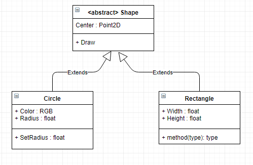

``Shape`` will be an abstract class, with two classes derived from it, ``Circle`` and ``Rectangle``.

Let's look at what we have here in ``Review05``

Shape.h/cpp
^^^^^^^^^^^^^^^^^^^^^^^^^^^^^^^^^^^^^^^^^^^^^^^^^^^^^^^^^^^^^^^^^^^^^^^^^^^^^^^^^^^^^^^^^^^^^^^^^^^^^^^^^^^^^^^^^^^^^^^

.. code-block::   C++

    /// Shape.h -------------------------------------------
    #pragma once

    struct Point2D
    {
        float x;
        float y;

        Point2D(float inX, float inY)
        {
            x = inX;
            y = inY;
        }
    };

    class Shape
    {
    public:
        Shape();
        Shape(float inX, float inY);

        virtual ~Shape();

        Point2D mCenter;

        // Adding an `= 0` to the end of a method declaration
        // signifies that this is a pure virtual method, and thus
        // makes this an abstract base class.
        virtual void Draw() = 0;
    };

    /// === File Separator ================snip-snip-snip==

    /// Shape.cpp -----------------------------------------
    #include "Shape.h"

    Shape::Shape() : mCenter(0.0f, 0.0f) {}

    Shape::Shape(float inX, float inY) : mCenter(inX, inY) {}

    Shape::~Shape() {}

Circle.h/cpp
^^^^^^^^^^^^^^^^^^^^^^^^^^^^^^^^^^^^^^^^^^^^^^^^^^^^^^^^^^^^^^^^^^^^^^^^^^^^^^^^^^^^^^^^^^^^^^^^^^^^^^^^^^^^^^^^^^^^^^^
.. code-block::   C++

    /// Circle.h ------------------------------------------
    #pragma once

    #include "Shape.h"

    class Circle : public Shape
    {
    public:
        Circle();
        Circle(float inX, float inY, float radius);

        virtual ~Circle();

        virtual void Draw() override;

        float mRadius;
    };

    /// === File Separator ================snip-snip-snip==

    /// Circle.cpp ----------------------------------------
    #include "Circle.h"

    #include <allegro5/allegro_primitives.h>

    Circle::Circle() : mRadius(1.0f) {}

    Circle::Circle(float inX, float inY, float radius) : Shape(inX, inY), mRadius(radius) {}

    Circle::~Circle() {}

    void Circle::Draw()
    {
        al_draw_circle(mCenter.x, mCenter.y, mRadius, al_map_rgb(255, 255, 255), 1.0f);
    }

#### Rectangle.h/cpp
^^^^^^^^^^^^^^^^^^^^^^^^^^^^^^^^^^^^^^^^^^^^^^^^^^^^^^^^^^^^^^^^^^^^^^^^^^^^^^^^^^^^^^^^^^^^^^^^^^^^^^^^^^^^^^^^^^^^^^^
.. code-block::   C++

    /// Rectangle.h ---------------------------------------
    #pragma once
    #include "Shape.h"

    class Rectangle : public Shape
    {
    public:
        Rectangle();
        Rectangle(float inX, float inY, float width, float height);

        virtual ~Rectangle();

        virtual void Draw() override;

        float mWidth;
        float mHeight;
    };

    /// === File Separator ================snip-snip-snip==

    /// Rectangle.cpp -------------------------------------
    #include "Rectangle.h"
    #include <allegro5/allegro_primitives.h>

    Rectangle::Rectangle() : Shape() {}

    Rectangle::Rectangle(float inX, float inY, float width, float height) : Shape(inX, inY), mWidth(width), mHeight(height) {}

    Rectangle::~Rectangle() {}

    void Rectangle::Draw()
    {
        al_draw_rectangle(
            mCenter.x - (mWidth / 2.0f), mCenter.y - (mHeight / 2.0f),
            mCenter.x + (mWidth / 2.0f), mCenter.y + (mHeight / 2.0f),
            al_map_rgb(255, 255, 255),
            1.0f);
    }

There's not very fancy with these classes. A couple of things to point out:

 1. ``Shape`` is an abstract base class because of the pure virtual function declaration. This means we can't directly
    instantiate a 'Shape'
 2. However, we can instantiate the derived classes (the concrete classes) ``Circle`` and ``Rectangle``.
 3. We also have ``virtual`` descructors in the base and in derived classes. This isn't strictly necessary right now, but 
    let's put it in and talk about it later.

main.cpp
^^^^^^^^^^^^^^^^^^^^^^^^^^^^^^^^^^^^^^^^^^^^^^^^^^^^^^^^^^^^^^^^^^^^^^^^^^^^^^^^^^^^^^^^^^^^^^^^^^^^^^^^^^^^^^^^^^^^^^^
.. code-block::   C++

    /// Main.cpp ------------------------------------------ 
    #include <allegro5/allegro.h>
    #include <allegro5/allegro_font.h>
    #include <allegro5/allegro_primitives.h>

    #include "Shape.h"
    #include "Circle.h"
    #include "Rectangle.h"

    ALLEGRO_FONT* gFont = nullptr;

    void main()
    {
        al_init();
        al_init_font_addon();
        al_init_primitives_addon();

        ALLEGRO_DISPLAY* display = al_create_display(800, 600);
        gFont = al_create_builtin_font();

        Shape* shapes[10];

        shapes[0] = new Circle(20.0f, 30.0f, 5.0f);
        shapes[1] = new Circle(40.0f, 60.0f, 10.0f);
        shapes[2] = new Circle(60.0f, 90.0f, 15.0f);
        shapes[3] = new Circle(80.0f, 120.0f, 20.0f);
        shapes[4] = new Circle(100.0f, 150.0f, 30.0f);
        shapes[5] = new Rectangle(200.0f, 300.0f, 5.0f , 5.0f);
        shapes[6] = new Rectangle(220.0f, 330.0f, 10.0f, 10.0f);
        shapes[7] = new Rectangle(240.0f, 360.0f, 15.0f, 15.0f);
        shapes[8] = new Rectangle(260.0f, 390.0f, 20.0f, 20.0f);
        shapes[9] = new Rectangle(280.0f, 420.0f, 25.0f, 25.0f);

        for (int index = 0; index < 10; index++)
        {
            shapes[index]->Draw();
        }

        al_flip_display();
        al_rest(5.0);

        al_destroy_font(gFont);
        al_destroy_display(display);
    }

Compile that. And it works!

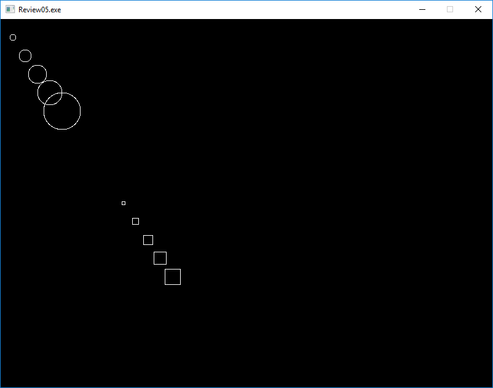

But it's wrong. Very, very wrong.

Note all the ``new`` keywords. That's memory allocations of the class ``Circle`` and ``Rectangle``. When you ``new`` a 
class, you get back a pointer to the newly allocated object on the heap. If you remember earlier, I also said that 
anything you allocate from the heap, you have to clean up. So right now, we're leaking 5 ``Circle`` and 5 ``Rectangle`` 
objects.

How do we clean them up? We delete them, using the ``delete`` keyword. We end up with syntax that looks like this: 
``delete shapes[0];``. And we've deleted the first object we allocated! But there are 9 more to go:

.. code-block::   C++

    // changes to make ...
    for (int index = 0; index < 10; index++)
    {
        shapes[index]->Draw();
    }

    al_flip_display();
    al_rest(5.0);

    // Add this!
    delete shapes[0];
    delete shapes[1];
    delete shapes[2];
    delete shapes[3];
    delete shapes[4];
    delete shapes[5];
    delete shapes[6];
    delete shapes[7];
    delete shapes[8];
    delete shapes[9];

And we now are no longer leaking memory!

But that's pretty hokey to have to track and delete objects like that. What if we wanted to allocate an arbitrary 
number of shapes? That current strategy isn't going to work. So what do we do?  C++ comes with an ``operator delete[]`` 
`C++ new operator link <http://www.cplusplus.com/reference/new/operator%20delete[]/>`_

    | operator delete[] is a regular function that can be called explicitly just as any other function. But in C++, 
      delete[] is an operator with a very specific behavior: An expression with the delete[] operator, first calls the 
      appropriate destructors for each element in the array (if these are of a class type), and then calls an array 
      deallocation function.

Well that sure sounds like an appropriate replacement now, doesn't it? Let's try it:

.. code-block:: C++

    for (int index = 0; index < 10; index++)
    {
        shapes[index]->Draw();
    }

    al_flip_display();
    al_rest(5.0);

    // use this instead!
    delete[] shapes;

That compiles no problem. Let's run it!

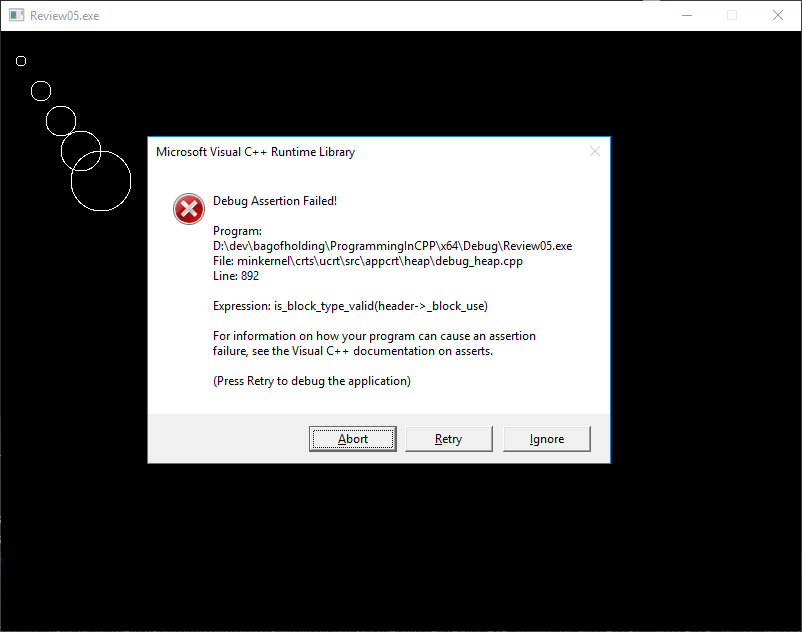

``Expression: is_block_type_valid(header->_block_use)`` ... what in the world does that mean. You can go ahead and 
google that if you want to, but I don't think it'll give you back anything good.

So what's going on. The definition from the cpluscplus website says that we're deleting the array!

But are we? Check out the code again, but this time with an eye on how we create the array:

``Shape* shapes[10];``

What does that mean, exactly? Reading it from right to left:

We're creating a 10 element array of ``Shape`` pointers (that's what the ``*`` means).

OK, we're creating an array of pointers. And that's what we're trying to delete, are the pointers in the array!

But hang on a minute there, cowboy. Check out the definition of what ``delete[]`` actually does:

    | An expression with the delete[] operator, first calls the appropriate destructors for each element in the array 
      (if these are of a class type), *and then calls an array deallocation function*.

But that's what we're doing there. We are deleting the array that we created there. Or are we?

Here's how we create the array:

``Shape* shapes[10];``

That's an array of 10 ``Shape`` pointers. So ``delete []`` has got to work.

Let me ask you a question. What's the difference between these two lines:

.. code-block::   C++

    Shape* shapes[10];
    int numbers[10];

One of those lines creates an array of ``Shape`` pointers. The other is an array of ``int``s. And where do these arrays 
live? If you're first response is "on the stack", they you win a no-prize! Arrays of this sort are allocated on the 
stack. You cannot deallocate (``delete``) from items created on the stack! And that's what we're seeing in the error. 
What we *have* allocated on the heap are the objects the slots in the ``shapes`` array are pointing to. So we *do* have 
to iterate over all the elements in the list to delete them. We *can* clean up the code to be a little less icky:

.. code-block::   C++

    for (int index = 0; index < 10; index++)
    {
        delete shapes[index];
    }

That solves the problem, but it still leaves us with "how do we use `delete[]`". Well, we actually have to create the 
array on the heap.

.. code-block::   C++

    // Shape* shapes[10];
    Shape** shapes = new Shape*[10];  // This allocates a block of memory big enough for 10 shape pointers

    // snip

    al_flip_display();
    al_rest(5.0);

    delete[] shapes;  // <== New bit of code

    al_destroy_font(gFont);
    al_destroy_display(display);

Let me ask you a question ...
-----------------------------------------------------------------------------------------------------------------------
What would happen if my ``main`` function looked like this:

.. code-block::   C++

    Shape** shapes = new Shape*[10];

    for (int index = 0; index < 10; index++)
    {
        shapes[index]->Draw();
    }

    delete[] shapes;

Hopefully you'd expect that not to work. First off, we've not actually put anything into that array. But what's in that 
memory block?

Have I got a picture for you:

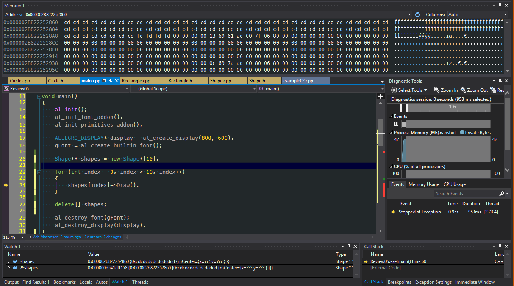

Got a lot going on there. So the next image breaks down what we're seeing:

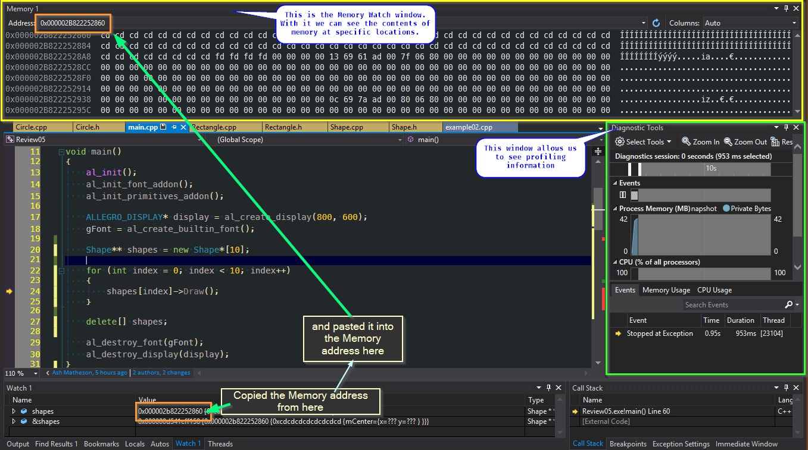

So, in the memory watch window, there's a lot of ``CD`` and ``FD`` values.  What do they mean?

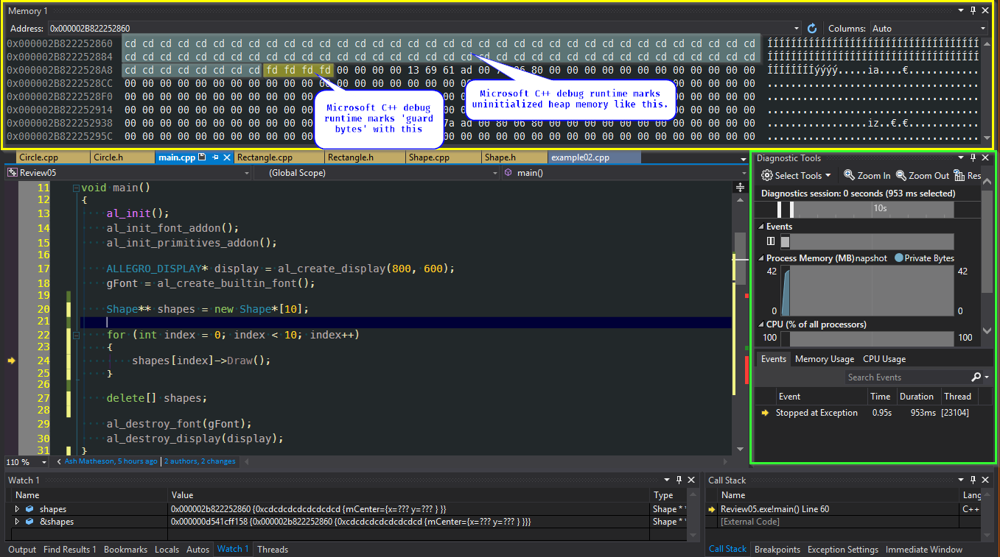

Here's a handy little table to refer to what some common values are:

`nobug.org's CRT Heap Table <http://www.nobugs.org/developer/win32/debug_crt_heap.html#table>`_

That's cool, but that's not the whole story.  We're currently running in Debug. What happens when we run in release?

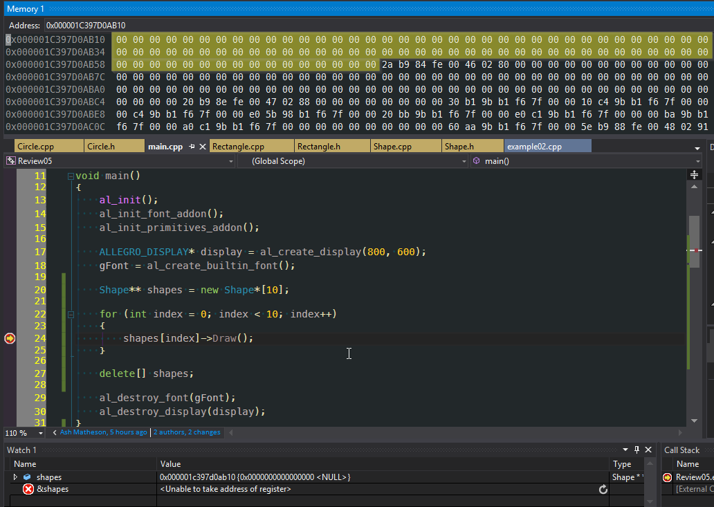

Ahh, it's all zeros.  That's good.  Or is it?

New isn't supposed to 'clear' memory - it should just be grabbing a block of memory that isn't in use and blocking it 
off. So I would expect random data in that.

Let's try something simple,

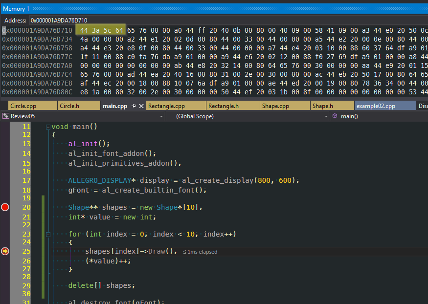

So to test our theory, we're allocating a single ``int`` on the heap. Taking a look at the memory block, we get the 
result we expect (that is, an uninitialized block of memory).

This is getting frustrating, isn't it?

Let's take a look at this:

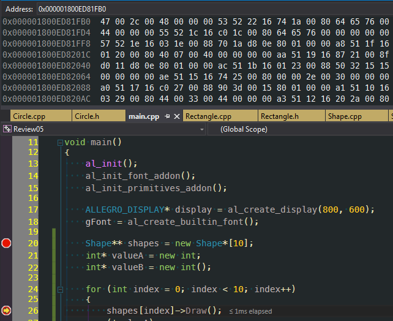

We're seeing in that slide that ``int* valueA = new int;`` doesn't clear memory. However ...

In this case, ``int* valueB = new int();`` *does* clear the block of memory!  From 
`Stack Overflow here <https://stackoverflow.com/questions/7546620/operator-new-initializes-memory-to-zero>`_ we can 
see that the C++ 11 standard it will clear the allocated block to 0.

BUT THAT'S NOT WHAT WE'RE DOING IN OUR ARRAY!

I'm going to add in the ``()`` to our ``Shape`` array creation:

eg: it was:

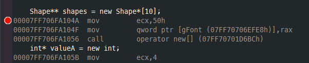

three lines of assembly. All it does is call operator ``new[]``.

VS:

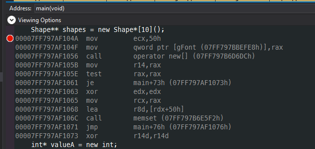

And it does significantly more work! The call to ``memset`` should make you think that it's setting the block to
all zeros.

So ... Is that's what's happening here? Is C++ aliasing our call to this? Well, there's one more test we can do.
We write a quick, sample console app to test this all again! With that in mind, I've writting ``Review05B``.

And here's what it looks like:

.. code-block:: C++

    struct Point2D
    {
        float x;
        float y;

        Point2D(float inX, float inY)
        {
            x = inX;
            y = inY;
        }
    };

    class Shape
    {
    public:
        Shape();
        Shape(float inX, float inY);

        virtual ~Shape();

        Point2D mCenter;

        virtual void Draw() = 0;
    };

    void main()
    {
        Shape** shapes = new Shape*[10];
        int* valueA = new int;
        int* valueB = new int();

        for (int index = 0; index < 10; index++)
        {
            shapes[index]->Draw();
            (*valueA)++;
            (*valueB)++;
        }

        delete[] shapes;
    }

And our result?

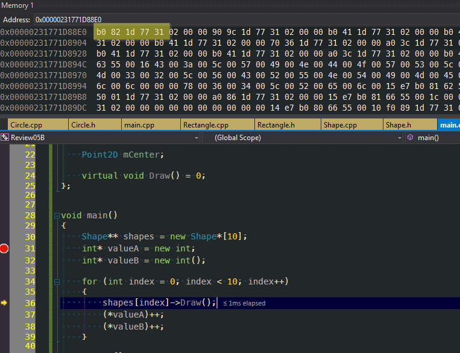

OK, so what the heck is going on here? This is what I'm expecting to see. This is the
normal behaviour that makes sense to me.

I'm still not sure, but I have some guesses.

 1. Allegro has, for some reason, overridden the operator new. This is a highly, highly suspect assumption.
 2. It is very possible that I'm "Just getting (un)lucky". ``new`` is returning me block of memory that are already 
    nulled.

Both situations are possible. I'm starting to lean toward #2, myself.  Mostly because of being able to do ``placement new``
and this bit of code:

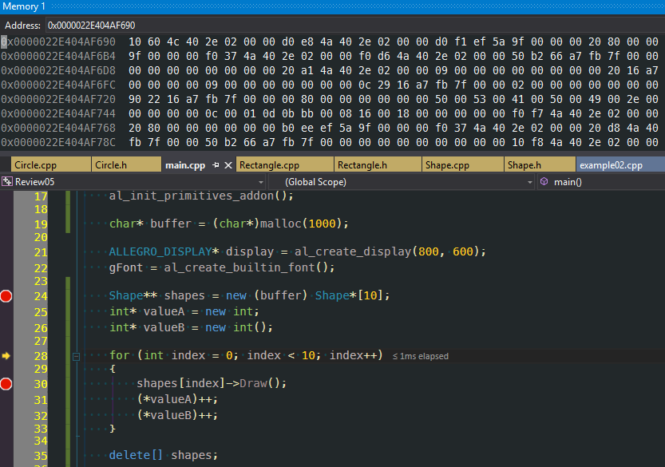

Placement ``new`` allows me to pre-allocate a block of memory and use that as my 'pool' to draw from. In this case
I use ``malloc`` to allocate 1000 bytes and stuff it into ``buffer``. Then, using

``Shape** shapes = new (buffer) Shape*[10];``

I can pull from that block. And from the image you can see that it's random data (also, the address of ``buffer`` and 
``shapes`` is the same, but it's not shown in the slide).

Holy crap, that was a long, long review. And I really want to go into more details. But I think that's enough for now.

That was quite the review. And it's debatable that I've covered everything that would be considered 'a review'. But I 
feel that's enough 'basics' to cover for now. It's very possible I'll come back and add/revise this in the future, but 
as a starting point I consider the review over.
